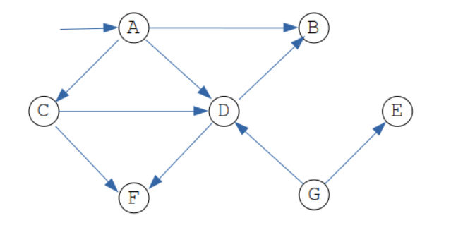
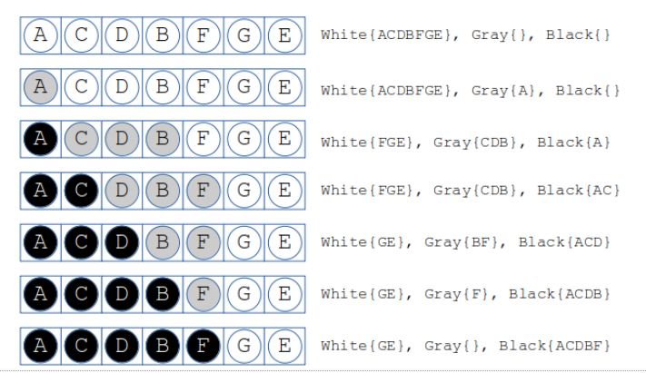

Go 언어에서 사용하는 가비지 컬렉터의 개념과 작동방식을 살펴본다.
또한 Go 프로그램에서 C 코들르 호출하는 방법도 소개한다. (skip)

## Go 컴파일러

Go 컴파일러는 go 커맨드로 실행한다. 이 커맨드는 단순히 실행 파일을 생성하는데 그치지 않고 상당히 많은 작업을 한다

Go 언어로 작성된 소스 파일을 컴파일하려면 go tool compile 커맨드를 실행한다. 그러면 오브젝트 파일이 생성되며 확장자는 `.o`이다.

```bash
go tool compile unsafe.go

ls -l unsafe.o
-rw-r--r--  1 user  staff   9.2K 11  5 15:59 unsafe.o

file unsafe.o # go 버전 때문에 책과 다르게 아카이블 파일
unsafe.o: current ar archive

# 아카이브 파일이란 일종의 바이너리 파일로서 여러 파일을 하나의 파일로 묶을 때 사용한다.
ar t unsafe.o
__.PKGDEF
_go_.o
```

go tool compile 에서 `-race`를 사용할수 있고 이는 race condition을 감지할 수 있다. 자세한건 10장 'Go 언어의 동시성'를 확인바란다.

## 가비지 컬렉션

보다 자세한 Go GC 가이드는 문서 참고 - https://tip.golang.org/doc/gc-guide

Garbage Collection (aㅔ모리 재활용)이란 더 이상 사용하지 않는 메모리 공간을 해제하는 프로세스다. 다시 말해 가비지 컬렉터는 현재 scope(유효 범위)를 벗어난 오브젝트를 발견하고, 이를 더 이상 참조할 일이 없다고 판단하면 그 공간을 해제한다.
[mgc.go](https://go.dev/src/runtime/mgc.go) 공식 문서를 보면 다음과 같이 구현했다고 한다.

> The GC runs concurrently with mutator threads, is type accurate (aka precise), allows multiple
> GC thread to run in parallel. It is a concurrent mark and sweep that uses a write barrier. It is
> non-generational and non-compacting. Allocation is done using size segregated per P allocation
> areas to minimize fragmentation while eliminating locks in the common case.

한글로 해석하면

> GC는 뮤테이터 스레드와 함께 동시에 실행되며, 타입을 엄격히 따지고 여러 GC 스레들르 병렬로 실행할 수 있다.
> 쓰기 장벽을 사용하는 표시 후 쓸어 담기 알고리즘의 동시성 버전으로, 비세대형, 비압축형 방식이다.
> 할당 작업은 잠김 현상이 발생하지 않으면서 단편화를 최소화하도록 P 할당 영역마다 분리한 크기로 처리한다.

```go
// gColl.go
package main

import (
	"fmt"
	"runtime"
	"time"
)

// 가비지 컬렉션 통계에 대한 최신 정보를 조회하려면 매번 해당 함수를 호출해야 한다.
func printStats(mem runtime.MemStats) {
	runtime.ReadMemStats(&mem)
	fmt.Println("mem.Alloc:", mem.Alloc)
	fmt.Println("mem.TotalAlloc:", mem.TotalAlloc)
	fmt.Println("mem.HeapAlloc:", mem.HeapAlloc)
	fmt.Println("mem.NumGC:", mem.NumGC)
	fmt.Println("-----")
}

func main() {
	var mem runtime.MemStats
	printStats(mem)

    // for 루프문을 통해 여러 개의 거대한 Go slice를 생성했다. 이를 통해서 방대한 양의 메모리를 할당했다가 가비지 컬렉터를 호출할 것이다.
	for i := 0; i < 10; i++ {
		s := make([]byte, 50000000)
		if s == nil {
			fmt.Println("Operation failed!")
		}
	}
	printStats(mem)

    // Go slice로 더 많은 메모리를 할당한다.
	for i := 0; i < 10; i++ {
		s := make([]byte, 100000000)
		if s == nil {
			fmt.Println("Operation failed!")
		}
		time.Sleep(5 * time.Second)
	}
	printStats(mem)
}

/**
$ go run gColl.go
mem.Alloc: 126376
mem.TotalAlloc: 126376
mem.HeapAlloc: 126376
mem.NumGC: 0
-----
mem.Alloc: 50125128
mem.TotalAlloc: 500175272
mem.HeapAlloc: 50125128
mem.NumGC: 9
-----

mem.Alloc: 123448
mem.TotalAlloc: 1500258256
mem.HeapAlloc: 123448
mem.NumGC: 20
-----
```

가비지 컬렉터의 작동 과정을 다소 느릿한 애플리케이션을 통해 살펴봄으로써 향후 많은 시간ㅇ르 절약 할 수 있다.

Go 가비지 컬렉터의 작동 과정을 보다 상세하게 출력하려면 다음과 같이실행한다.

```bash
# GODEBUG=gctrace=1 go run gColl.go
gc 1 @0.008s 3%: 0.010+1.3+0.10 ms clock, 0.080+0.93/0.60/0+0.85 ms cpu, 4->4->0 MB, 5 MB goal, 8 P
gc 2 @0.015s 2%: 0.059+0.38+0.004 ms clock, 0.47+0.27/0.26/0.016+0.035 ms cpu, 4->4->0 MB, 5 MB goal, 8 P
gc 3 @0.033s 1%: 0.032+0.32+0.006 ms clock, 0.26+0.11/0.35/0.56+0.049 ms cpu, 4->4->0 MB, 5 MB goal, 8 P
gc 4 @0.046s 1%: 0.028+0.24+0.010 ms clock, 0.22+0.090/0.34/0.25+0.082 ms cpu, 4->4->0 MB, 5 MB goal, 8 P
gc 5 @0.058s 1%: 0.028+0.36+0.009 ms clock, 0.22+0.11/0.42/0.67+0.078 ms cpu, 4->4->0 MB, 5 MB goal, 8 P
gc 6 @0.078s 2%: 0.44+1.8+0.12 ms clock, 3.5+0.54/2.0/0+0.99 ms cpu, 4->4->1 MB, 5 MB goal, 8 P
gc 7 @0.086s 2%: 0.095+0.41+0.020 ms clock, 0.76+0.078/0.50/0.35+0.16 ms cpu, 4->4->1 MB, 5 MB goal, 8 P
gc 8 @0.087s 2%: 0.032+0.28+0.001 ms clock, 0.25+0.063/0.39/0.30+0.013 ms cpu, 4->4->0 MB, 5 MB goal, 8 P
gc 9 @0.090s 2%: 0.077+0.67+0.001 ms clock, 0.62+0.11/0.38/0.032+0.015 ms cpu, 4->5->1 MB, 5 MB goal, 8 P
gc 10 @0.092s 2%: 0.060+0.68+0.002 ms clock, 0.48+0.17/0.70/0.18+0.019 ms cpu, 4->4->1 MB, 5 MB goal, 8 P
# command-line-arguments
gc 1 @0.000s 9%: 0.003+0.76+0.001 ms clock, 0.028+0.064/0.93/0.10+0.015 ms cpu, 4->7->5 MB, 5 MB goal, 8 P
gc 2 @0.004s 5%: 0.003+0.63+0.007 ms clock, 0.026+0/1.1/0.072+0.058 ms cpu, 9->9->8 MB, 11 MB goal, 8 P
gc 3 @0.025s 1%: 0.023+0.69+0.006 ms clock, 0.18+0.056/0.95/0.74+0.053 ms cpu, 15->15->9 MB, 17 MB goal, 8 P
mem.Alloc: 127864
mem.TotalAlloc: 127864
mem.HeapAlloc: 127864
mem.NumGC: 0
-----
gc 1 @0.000s 2%: 0.002+0.058+0.001 ms clock, 0.017+0.037/0.046/0.037+0.010 ms cpu, 47->47->0 MB, 48 MB goal, 8 P
gc 2 @0.004s 0%: 0.022+0.079+0.001 ms clock, 0.17+0.034/0.049/0.013+0.014 ms cpu, 47->47->0 MB, 48 MB goal, 8 P
gc 3 @0.008s 1%: 0.022+0.094+0.002 ms clock, 0.18+0.055/0.043/0.024+0.017 ms cpu, 47->47->0 MB, 48 MB goal, 8 P
gc 4 @0.009s 1%: 0.017+0.090+0.001 ms clock, 0.13+0.037/0.047/0.033+0.009 ms cpu, 47->47->0 MB, 48 MB goal, 8 P
gc 5 @0.010s 1%: 0.021+0.089+0.002 ms clock, 0.17+0.031/0.066/0+0.017 ms cpu, 47->47->0 MB, 48 MB goal, 8 P
gc 6 @0.011s 1%: 0.018+0.076+0.001 ms clock, 0.14+0.039/0.057/0.017+0.011 ms cpu, 47->47->0 MB, 48 MB goal, 8 P
gc 7 @0.012s 1%: 0.016+0.067+0.002 ms clock, 0.13+0.042/0.033/0.003+0.017 ms cpu, 47->47->0 MB, 48 MB goal, 8 P
gc 8 @0.013s 1%: 0.017+0.058+0.001 ms clock, 0.13+0.024/0.043/0.013+0.010 ms cpu, 47->47->0 MB, 48 MB goal, 8 P
gc 9 @0.014s 1%: 0.015+0.063+0.001 ms clock, 0.12+0.037/0.048/0.026+0.013 ms cpu, 47->47->0 MB, 48 MB goal, 8 P
mem.Alloc: 50124952
mem.TotalAlloc: 500176776
mem.HeapAlloc: 50124952
mem.NumGC: 9
-----
gc 10 @0.015s 1%: 0.017+0.59+0.012 ms clock, 0.13+0.025/0.058/0.009+0.096 ms cpu, 47->143->95 MB, 48 MB goal, 8 P
gc 11 @5.017s 0%: 0.043+0.20+0.005 ms clock, 0.34+0/0.20/0.14+0.041 ms cpu, 190->190->0 MB, 191 MB goal, 8 P
gc 12 @10.038s 0%: 0.028+0.20+0.003 ms clock, 0.23+0/0.19/0.067+0.028 ms cpu, 95->95->0 MB, 96 MB goal, 8 P
gc 13 @15.050s 0%: 0.049+0.11+0.003 ms clock, 0.39+0/0.16/0.084+0.030 ms cpu, 95->95->0 MB, 96 MB goal, 8 P
gc 14 @20.062s 0%: 0.031+0.11+0.006 ms clock, 0.25+0/0.16/0.085+0.048 ms cpu, 95->95->0 MB, 96 MB goal, 8 P
gc 15 @25.074s 0%: 0.035+0.14+0.006 ms clock, 0.28+0/0.19/0.10+0.052 ms cpu, 95->95->0 MB, 96 MB goal, 8 P
gc 16 @30.084s 0%: 0.031+0.12+0.005 ms clock, 0.25+0/0.16/0.068+0.047 ms cpu, 95->95->0 MB, 96 MB goal, 8 P
gc 17 @35.096s 0%: 0.035+0.11+0.008 ms clock, 0.28+0/0.18/0.13+0.071 ms cpu, 95->95->0 MB, 96 MB goal, 8 P
gc 18 @40.106s 0%: 0.038+0.18+0.005 ms clock, 0.30+0/0.22/0.13+0.043 ms cpu, 95->95->0 MB, 96 MB goal, 8 P
gc 19 @45.113s 0%: 0.025+0.13+0.025 ms clock, 0.20+0/0.11/0.014+0.20 ms cpu, 95->95->0 MB, 96 MB goal, 8 P
mem.Alloc: 123368
mem.TotalAlloc: 1500259864
mem.HeapAlloc: 123368
mem.NumGC: 19
-----
```

가비지 컬렉션 프로세스가 진행되는 동안 할당된 힙 크기를 보다 자세히 알 수 있다. 예를 들어 `95->95->0 MB`라고 표현된 부분을 보자.
여기서 첫 번째 숫자는 가비지 컬렉터가 실행될 시점의 힙 크기다. 두 번째 값은 가비지 컬렉터가 실행을 마칠 시점의 힙 크기다.
마지막 값은 현재 힙 크기이다.

### 삼색(tricolor) 알고리즘

Go 언어의 가비지 컬렉터는 삼색 알고리즘에 따라 작동한다.

삼색 표시 후 쓸어 담기 알고리즘 (tricolor mark-and-sweep algorithm)를 이용한다. 이 알고리즘은 프로그램과 동시에 작동하며 쓰기 장벽 (write barrier)를 활용한다.
따라서 Go 프로그램이 실행될 때, Go 스케줄러는 마치 여러 개의 Go 루틴으로 구성된 일반 애플리케이션을 다루듯이, 애플리케이션과 가비지 컬렉터에 대한 스케줄링을 담당한다.
Go 루틴과 Go 스케줄러에 대해서는 `9장 Go 언어읭 동시성`에서 자세히 소개한다.

이 알고리짐의 핵심은 1978에 [On-the-fly garbage collection: an exercise in cooperation 논문](https://dl.acm.org/doi/10.1145/359642.359655)에서 처음 발표했다.
핵심 원리는 힙에 있는 오브젝트를 이 알고리즘에 따라 세 가지 색깔로 지정된 집합으로 나누는 데 있다. 자세한건 다음 섹션 `Go 언어의 가비지 컬렉터의 구체적인 동작 방식` 참고.

이제 삼색 집합의 의미에 대해 알아보자.

- `흰색` 집합에 있는 오브젝트는 프로그램에서 더 이상 접근할 수 없어서 가비지 컬렉션 대상이 되는 것이다.
- `검은색` 집합에 속한 오브젝트는 프로그램이 사용하고 있으며, 흰색 집합의 오브젝트를 가리키는 포인터가 확실히 없는 것이다.
  - 하지만 흰색 집합에 있는 오브젝트는 검은색 집합의 오브젝트를 가리키는 포인터를 가질 수 있다. 그래도 가비지 컬렉터 동작에 아무런 영향을 미치지 않기 때문에 상관없다.
- `회색` 집합에 있는 오브젝트는 프로그램이 현재 사용하고 있지만 흰색 오브젝트르 가리킬 수도 있어서 검사 과정을 거쳐야 할 것들이다.

여기서 주목할 점은, 검은색 집합에서 곧바로 흰색 집합으로 갈 수 없다는 점이다.
그래서 가비지 컬렉터가 흰색 집합에 있는 오브젝트를 확인한 후 제거하는 작업을 수행할 수 있는 것이다.
또한 `검은색` 집합에 있는 오브젝트는 흰색 집합의 오브젝트를 직접 가리킬 수 없다.

가비지 컬렉터는 모든 오브젝트가 `흰색`인 상태로 시작하며, 모든 루트 오브젝트를 방문해서 `회색`으로 칠한다.
여기서 루트 오브젝트란, 스택에 있는 오브젝트나 전역 변수처럼 애플리케이션에서 직접 접근할 수 있는 오브젝트를 말한다. 구체적인 대상은 프로그램마다 다르다.
그런 다음, 가비지 컬렉터는 `회색` 오브젝트를 하나씩 뽑아서 `검은색`으로 바꾸고, 그 오브젝트에 혹시 `흰색` 집합이 있는 오브젝트를 가리키는 포인터가 있는 지 탐색한다.
다시 말해, `회색` 오브젝트가 가리키는 포인터를 검사할 때, 그 `회색` 오브젝트를 `검은색`으로 칠한다. 이 과정에서 `흰색` 오브젝트를 가리키는 포인터가 한 개 이상 발견되면, 그 포인터가 가리키는 `흰색` 오브젝트를 `회색` 집합에 넣는다.
이 작업은 `회색` 집합에 오브젝트가 없어질 때까지 계속 진행된다. 이 작업이 끝나면 더 이상 접근할 수 없는 오브젝트만 `흰색` 집합에 남게 되며, 여기에 할당된 메모리 공간은 재사용 가능한 상태가 된다.
따라서 이 시점에서 `흰색` 집합의 오브젝트느 가비지 컬렉션 됐다고 표현한다.



1. A (root node)에서 시작해서 회색으로 전환
2. A가 연결가능한 노드 (C, D, B)가 있으니 검은색으로 전환
3. C 부터 회색 처리
4. C가 연결해서 A로 연결 가능한 노드 (F, D)가 있으니 검은색으로 전환
5. 3~4를 D, B 그리고 마지막으로 F에 적용
6. G E 는 root에 서 접근 못하기 때문에 흰색 유지 <- GC 대상



> Note garbage collection runs in cycles. If any objects in the gray set become unreachable at some point, the garbage collector deals with it in the next cycle.

이 작업이 진행되는 동안 mutator (경쟁자)라 부르는 애플리케이션이 실행된다.
뮤테이터는 힙에 있는 포인터가 변경될 때마다 쓰기 장벽 (write barrier)이라 부르는 조그만 함수를 실행한다.
힙에 있는 오브젝트의 포인터가 변경되면, 다시 말해 이 오브젝트에 접근할 수 있게 됐다면, 쓰기 장벅은 이를 회색으로 칠해서 회색 집합에 넣는다.

> 뮤테이터는 검은색 집합의 원소 중 어느 것도 흰색 집합 원소를 가리키지 않는다는 불변 속성 (invariant)을 유지하는 역할을 담당한다. 이 과정에서 쓰기 장벽 함수의 도움을 받는다.
> 이러한 불변 속성이 깨지면 가비지 컬렉션 프로세스가 망가진다. 따라서 실행한 프로그램이 이상하고 바라집하지 않는 방식으로 동작한다.

Go 언어의 가비지 컬렉션은 채널 변수에도 적용된다. 도달할 수 없으면서 더 이상 접근하지도 않는 채널을 가비지 컬렉터가 발견하면, 그 채널을 아직 닫지 않았더라도 채널에 할당된 리소스를 해제한다. 채널에 대해서는 9장, 'Go 언어의 동시성' 에서 자세히 소개한다.

Go 언어에서는 가비지 컬렉션을 수동으로 작동시킬 수 있도록 `runtime.GC()` 함수를 제공한다.
여기서 주의할 점은 `runtime.GC()`를 호출하면 작업이 완전히 끝날 때까지 코드의 실행이 멈춘다는 점이다. 특히 여러 오브젝트를 다루면서 굉장히 바쁘게 돌아가고 있다면 프로그램 전체가 일시적으로 멈출 수 있다.
이렇게 멈추는 주된 이유는, 모든 것이 굉장히 빠르게 변하고 있는 동안에는 가비지 컬렉션 작업을 수행할 수 없기 때문이다. 이렇게 일시적으로 멈춘 상태를 가비지 컬렉션 안전점 (garbage collection safe-point)이라고 부른다.

### Go 언어 가비지 컬렉터의 구체적인 작동 방식

GO 언어의 가비지 컬렉터에서 갖아 신경 쓰는 부분은 지연 시간을 낮추는 것이다. 다시 말해 가비지 컬렉터의 작동 과정에서 일시적으로 멈추는 시간을 최소화해서 연산을 실시간으로 처리하게 하는 것이다.

가비지 컬렉션에서는 전통적으로 표시 후 쓸어 담기 알고리즘 (mark-and-sweep algorithm)을 사용했다. 이 알고리즘은 가비지 컬렉터를 구현하기 위한 가장 간단한 알고리즘이다.

1. 먼저 프로그램 실행을 잠시 멈추고, 프로그램의 힙에서 접근할 수 있는 오브젝트를 모두 방문한 뒤에 적절히 표시한다.
2. 그런 다음 접근 할 수 없는 오브젝트를 쓸어 담는다.

이 알고리즘에서 표시 단계를 수행하는 동안, 모든 오브젝트가 흰색, 회색, 검은색 중 하나로 표시된다. ㅗ히색 오브젝트의 자식도 회색으로 칠하지만, 원래 회색이던 오브젝트는 검은색으로 바꾼다.
그러다가 더 이상 검토할 회색 오브젝트가 없으면 쓸어 담기 단계로 넘어간다. 표시 후 쓸어 담기 알고리즘이 제대로 작동하는 이유는 이 알고리즘의 불변 속성인 검은색 집합에서 흰색 집합을 가리키는 포인터가 없기 때문이다.

표시 후 쓸어 담기 알고리즘은 간단하다는 장점은 있지만, 이를 수행하는 동안 프로그램의 실행을 잠시 멈춰야 한다. 따라서 실제 프로세스에 지연 시간(latency)이 발생하게 된다.
Go 언어는 가비지 컬렉터를 동시성 프로세스로 실행하고, 앞 절에서 소개한 삼색 알고리즘ㅇ르 적용함으로써 이러한 지연 시간을 최소화하고 있다. 하지만 이렇게 가비지 컬렉터가 동시에 실행되는 동안에 얼마든지 다른 프로세스에 의해 포인터가 변경되거나, 새로운 오브젝트가 생성될 수 있다.
그래서 가바지 컬렉터를 효율적으로 구현하기가 힘들다. 결론적으로 삼색 알고리즘을 동시에 실행하는 데 갖아 중요한 점은, 표시 후 쓸어 담기 알고리즘의 불변 속성을 유지하는 것이다. 다시 말해 검은색 집합의 오브젝트가 흰색 집합의 오브젝트를 가리키지 않아야 한다.

이러한 문제를 해결하기 위한 한 가지 방법은 이 알고리즘에서 문제 발생 요인을 모두 제거하는 것이다. 따라서 새로운 오브젝트는 반드시 회색 집합으로 가야한다. 그래야 표시 후 쓸어 담기 알고리즘의 불변 속성이 바뀌지 않는다.
또한 프로그램에 나온 포인터가 이동하면 포인터가 가리키던 오브젝트도 회색으로 변경된다. 회색 집합이 흰색 집합과 검은색 집합 사이의 장벽의 역할을 한다고 볼 수 있다.
마지막으로 포인터가 변경될 때마다 앞에서 언급한 쓰끼 장벽(write barrier)이라 부르는 Go 코드가 자동으로 실행되면서 색깔 변경 작업을 수행한다.

쓰기 장벽 코드를 실행함으로써 발생하는 지연 시간은 가비지 컬렉터를 동시에 실행하기 위해 치러야 할 대가인 셈이다.

한 가지 주의할 점이 있다. 자바 프로그램 언어는 다양한 가비지 컬렉터를 제공하며, 여러 가지 매개변수를 통해 설정을 다양하게 변경할 수 있다. 이러한 자바 가비지 컬렉터중에서도 G1은 저지연 애플리케이션에 적합하다.

### Unsafe Code

언ㅅ헤이브 코드란 Go 언어의 타입 안정성 및 메모리 보안 검사를 거치지 않는 코드를 말한다. 언세이프 코드라고 하면 대부분 포인터에 관련된 코드를 의미한다. 한 가지 명심할 점은, 프로그램에서 언세이프 코드를 사용하면 위험한 일이 발생할 수 있다는 것이다.

```go
// unsafe.go
package main

import (
	"fmt"
	"unsafe"
)

func main() {
	var value int64 = 5
	var p1 = &value
	var p2 = (*int32)(unsafe.Pointer(p1)) // int32 타입 포인터를 생성한다. Go 언어에서 모든 포인터는 unsafe.Pointer로 변활할 수 있다.

	fmt.Println("*p1: ", *p1)
	fmt.Println("*p2: ", *p2)
	*p1 = 5434123412312431212
	fmt.Println(value)
	fmt.Println("*p2: ", *p2) // 여기가 문제되는 부분
	*p1 = 54341234
	fmt.Println(value)
	fmt.Println("*p2: ", *p2)
}

/**
$ go run unsafe.go
*p1:  5
*p2:  5
5434123412312431212
*p2:  -930866580
54341234
*p2:  54341234
```

32 비트 포인터는 64비트 정수를 담을 수 없다는 점이다.

### unsafe 패키지

https://go.dev/src/unsafe/unsafe.go

```go
$ grep -v '^//' unsafe.go | grep -v '^$'
/*
        Package unsafe contains operations that step around the type safety of Go programs.
        Packages that import unsafe may be non-portable and are not protected by the
        Go 1 compatibility guidelines.
*/
package unsafe
type ArbitraryType int
type IntegerType int
type Pointer *ArbitraryType
func Sizeof(x ArbitraryType) uintptr
func Offsetof(x ArbitraryType) uintptr
func Alignof(x ArbitraryType) uintptr
func Add(ptr Pointer, len IntegerType) Pointer
func Slice(ptr *ArbitraryType, len IntegerType) []ArbitraryType
```

unsafe 패키지에 대한 나머지 코드는 어디에 있는 걸까?
Unsafe 패키지를 여러분이 프로그램에서 불러올 때 Go 컴파일러가 구현해준다.

### Unsafe 패키지에 대한 또 다른 예제

```go
// moreUnsafe.go
package main

import (
	"fmt"
	"unsafe"
)

func main() {
	array := [...]int{0, 1, -2, 3, 4}
	pointer := &array[0]
	fmt.Print(*pointer, " ")
	memoryAddress := uintptr(unsafe.Pointer(pointer)) + unsafe.Sizeof(array[0])

	for i := 0; i < len(array)-1; i++ {
		pointer = (*int)(unsafe.Pointer(memoryAddress))
		fmt.Print(*pointer, " ")
		memoryAddress = uintptr(unsafe.Pointer(pointer)) + unsafe.Sizeof(array[0])
	}
	fmt.Println()

    // 지정한 포인터와 메모리 주소에는 존재하지 않는 배열의 원소에 접근하고 있다. 이 코드에서는 unsafe 패키지를 사용하고 있기 때문에 Go 컴파일러에서 이런 논리적 에러를 찾아 주지 않는다.
	pointer = (*int)(unsafe.Pointer(memoryAddress))
	fmt.Print("One more: ", *pointer, " ")
	memoryAddress = uintptr(unsafe.Pointer(pointer)) + unsafe.Sizeof(array[0])
	fmt.Println()
}

/**
$ go run test.go
0 1 -2 3 4
One more: 1374390152936
```

## Go 에서 C 코드 호출하기 (skip)

## C 코드에서 Go 함수 호출하기 (skip)
