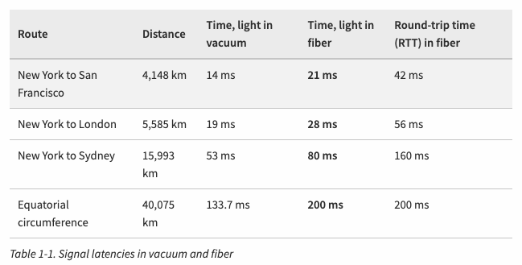
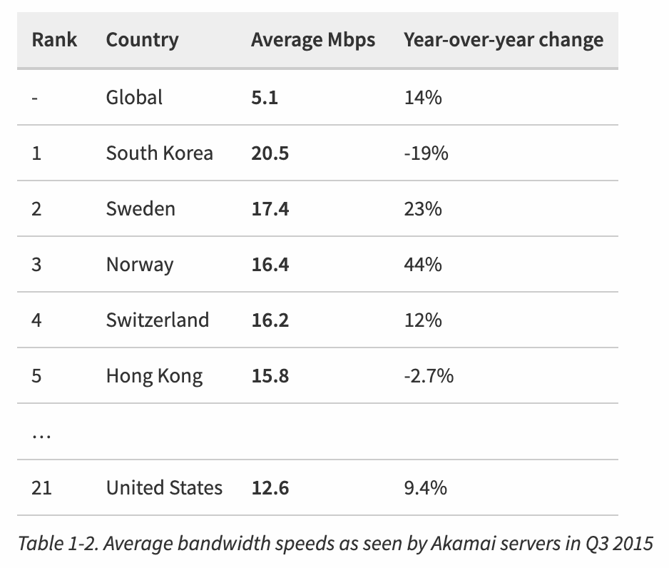

# Primer on Latency and Bandwidth

네트워크 성능의 두 가지 핵심 요소인 `지연 시간`과 `대역폭`에 대한 설명

## 속도는 중요한 기능이다 (Speed is a feature)

웹 성능 최적화(WPO, web performance optimization) 산업의 급성장은 웹사이트 속도가 사용자 경험에 미치는 영향을 강조합니다.
속도는 단순한 심리적 요소가 아니라 다음과 같은 실질적인 영향을 미칩니다.

- Faster sites lead to better user engagement.
- Faster sites lead to better user retention.
- Faster sites lead to higher conversions.

이처럼 속도는 웹사이트나 애플리케이션에서 필수적인 요소가 되었으며, 이를 개선하기 위해서는 지연 시간과 대역폭을 이해하는 것이 중요합니다.

- 지연 시간(Latency): 데이터 패킷이 출발지에서 목적지까지 도달하는 데 걸리는 시간
- 대역폭(Bandwidth): 특정 시간 동안 전송할 수 있는 데이터의 최대 양

### 대서양 횡단 지연 시간 단축: 하이버니아 익스프레스 (Decreasing Transatlantic Latency with Hibernia Express)

특정 산업에서는 지연 시간이 매우 중요한 요소입니다.
예를 들어, **고빈도 주식 거래(HFT, High-Frequency Trading)** 에서는 밀리초(ms) 단위의 차이가 큰 수익 또는 손실로 이어질 수 있습니다.

> 뉴욕에 증권사가 많은 이유가?

이를 위해 2015년 9월, 하이버니아 네트워크(Hibernia Networks)는 **하이버니아 익스프레스(Hibernia Express)** 라는 대서양 횡단 광케이블을 개통했습니다.

- 뉴욕 – 런던 간 최소 지연 시간: 58.95ms
- 기존 케이블 대비 5ms 단축
- 총 투자 비용: 3억 달러(약 4조 원)
- 밀리초당 투자 비용: 약 6천만 달러

이처럼, 지연 시간을 줄이는 것이 비즈니스적으로 매우 큰 가치를 가지는 경우도 있습니다.

## 지연 시간의 주요 요소 (The Many Components of Latency)

지연 시간은 다음과 같은 여러 요소로 구성됩니다.

1. 전파 지연 (Propagation Delay)

   - 신호가 출발지에서 목적지까지 이동하는 데 걸리는 시간
   - 거리에 따라 결정되며, 신호의 전파 속도(광섬유에서는 빛의 속도)에 의해 제한됨

2. 전송 지연 (Transmission Delay)

   - 패킷의 모든 비트가 네트워크에 전송되는 데 걸리는 시간
   - 패킷 크기와 네트워크 속도(대역폭)에 따라 결정됨

3. 처리 지연 (Processing Delay)

   - 패킷 헤더를 분석하고, 오류를 확인하며, 다음 전송 경로를 결정하는 데 걸리는 시간

4. 큐잉 지연 (Queuing Delay)

   - 네트워크 트래픽이 많을 경우, 패킷이 전송되기 전에 대기하는 시간

💡 총 지연 시간 = 전파 지연 + 전송 지연 + 처리 지연 + 큐잉 지연

예를 들어, 뉴욕과 런던 사이의 광섬유 케이블을 통해 신호가 이동할 때, 이론적으로 빛의 속도는 300,000km/s이지만, 실제 광섬유 속도는 약 200,000km/s입니다.
따라서 거리(약 5,600km)를 고려하면 **최소** 전파 지연은 약 28ms가 됩니다.

### Note

네트워크 데이터 전송 속도는 일반적으로 초당 비트 수(bps)로 측정되며, 비네트워크 장비의 데이터 전송 속도는 일반적으로 초당 바이트 수(Bps)로 표시됩니다. 이는 혼동의 일반적인 원인이므로, 단위를 주의 깊게 확인해야 합니다. 예를 들어, 10메가바이트(MB) 파일을 1Mbps 링크를 통해 "전송"하려면 80초가 필요합니다. 10MB는 80Mb와 동일하며, 이는 1바이트당 8비트이기 때문입니다.

## 빛의 속도와 전파 지연 시간 (Speed of Light and Propagation Latency)

네트워크에서 신호는 전기적 또는 광학적 형태로 전송되며, 이는 전파 지연 시간에 영향을 미칩니다. 전파 지연 시간은 신호가 송신자에서 수신자까지 이동하는 데 걸리는 시간으로, 거리와 신호의 전파 속도에 의해 결정됩니다.

이론적으로, 진공에서 빛의 속도는 약 299,792km/s입니다. 그러나 실제 네트워크에서는 신호가 광섬유 케이블과 같은 매체를 통해 전송되며, 이러한 매체의 굴절률로 인해 빛의 속도는 약간 감소합니다. 예를 들어, 광섬유의 굴절률은 약 1.5로, 이는 빛의 속도가 약 200,000km/s로 감소함을 의미합니다.

전파 지연 시간을 계산하기 위해서는 송신자와 수신자 간의 거리를 빛의 속도로 나누면 됩니다. 예를 들어, 2,000km 떨어진 두 지점 간의 전파 지연 시간은 약 10ms입니다.

그러나 실제 네트워크에서는 신호가 여러 라우터와 스위치를 거치며, 각 장비에서 처리 지연과 큐잉 지연이 추가로 발생합니다. 따라서 실제 지연 시간은 전파 지연 시간보다 더 길어질 수 있습니다.

이러한 이유로, 네트워크 성능을 최적화하기 위해서는 전송 지연, 처리 지연, 큐잉 지연 등 다양한 지연 요소를 고려해야 합니다. 또한, 데이터 전송 속도를 높이기 위해 대역폭을 늘리는 것도 중요합니다. 그러나 대역폭을 늘리는 것만으로는 지연 시간을 줄일 수 없으므로, 지연 시간을 줄이기 위한 다양한 기술과 전략이 필요합니다.

빛의 속도는 매우 빠르지만, 뉴욕에서 시드니까지 데이터 패킷이 왕복(RTT, Round-Trip Time)하는 데 **160ms** 가 걸립니다. 그러나 이는 이론적으로 가장 짧은 거리(대원형 경로, great-circle path)를 따라 **광섬유 케이블** 을 통해 이동한다고 가정한 값이며, 실제로는 그렇지 않습니다.

현실에서는 패킷이 여러 **라우터와 네트워크 노드를 거쳐 우회 경로** 를 따라 이동하게 되며, 이 과정에서 **라우팅, 처리, 대기(큐잉), 전송 지연** 등이 추가됩니다. 결과적으로 **실제 RTT는 200~300ms** 수준이 됩니다.

이 속도는 기술적으로는 매우 빠르지만, **사람의 인지 속도** 를 고려하면 다르게 해석할 수 있습니다. 연구에 따르면:

- **100~200ms 이상의 지연** 이 발생하면 사람들은 이를 "느려졌다"고 인식하기 시작함
- **300ms 이상** 이 되면 "반응이 둔하다"는 평가가 많아짐
- **1초(1,000ms) 이상 지연** 되면, 사용자는 기다리는 동안 "멘탈 컨텍스트 스위치(mental context switch)"를 수행하여, 집중력이 다른 곳으로 이동하는 경향이 있음

즉, 기술적으로 보면 빠른 속도라 해도, **사람이 지연을 인지하는 한계치** 를 넘어서면 사용자 경험이 크게 저하될 수 있습니다.

## 마지막 구간 지연 시간(Last-Mile Latency)

'마지막 구간(Last Mile)'은 인터넷 서비스 제공업체(ISP)의 인프라에서 최종 사용자까지의 연결 구간을 의미합니다. 이 구간은 일반적으로 가정, 사무실 또는 모바일 장치와 같은 최종 사용자 장치와 ISP의 지역 허브 또는 교환국 간의 연결을 포함합니다. '마지막 구간 지연 시간'은 이 구간에서 발생하는 지연 시간을 나타내며, 전체 네트워크 지연 시간에 상당한 영향을 미칠 수 있습니다.

미국 Federal Communications Commission(FCC)의 보고서에 따르면 시간이 지나면서 Last mile이 비교적 안정적으로 유지되고 있습니다. 광섬유의 평균 지연 시간은 10-20 ms로 가장 낮고, 케이블은 15-40 ms, DSL은 30-65 ms입니다.

## 코어 네트워크의 대역폭(Bandwidth in Core Networks)

광섬유는 두 끝 사이에서 빛을 전송하기 위해 설계된 간단한 "빛 파이프"로, 사람의 머리카락보다 약간 두꺼운 크기입니다. 금속 와이어도 사용되지만, 신호 손실, 전자기 간섭, 유지 보수 비용이 더 높습니다. 패킷은 두 가지 유형의 케이블 모두를 통해 전송될 수 있지만, 장거리 전송의 경우에는 대부분 광섬유 링크를 통해 이루어집니다.

광섬유는 대역폭 면에서 큰 장점을 가지고 있습니다. 이는 각 광섬유가 **파장 분할 다중화(WDM)** 라는 과정을 통해 여러 개의 서로 다른 파장(채널)의 빛을 전송할 수 있기 때문입니다. 따라서, 광섬유 링크의 총 대역폭은 채널당 데이터 전송 속도와 다중화된 채널 수의 곱입니다.

2010년 초, 연구자들은 한 채널당 최대 171 Gbit/s의 피크 용량을 가진 400개 이상의 파장을 다중화할 수 있었습니다. 이는 단일 광섬유 링크에서 총 70 Tbit/s 이상의 대역폭을 제공하는 것입니다. 이를 구현하기 위해 수천 개의 구리 와이어(전기) 링크가 필요합니다. 이러한 이유로 대륙 간의 해저 데이터 전송과 같은 장거리 전송은 대부분 광섬유 링크를 통해 이루어집니다. 각 케이블은 여러 개의 광섬유(일반적으로 4개)를 포함하며, 이는 각 케이블당 수백 테라비트당 초의 대역폭 용량을 제공합니다.

## 네트워크 엣지의 대역폭(Bandwidth at the Network Edge)

인터넷의 핵심 데이터 경로를 구성하는 백본(backbone) 또는 광섬유 링크는 초당 수백 테라비트의 데이터를 전송할 수 있습니다. 그러나 네트워크의 엣지, 즉 최종 사용자에게 제공되는 대역폭은 사용된 기술에 따라 크게 다르며, 일반적으로 훨씬 낮습니다. 예를 들어, 전화 접속(dial-up), DSL, 케이블, 다양한 무선 기술, 가정용 광섬유(fiber-to-the-home), 그리고 로컬 라우터의 성능 등에 따라 대역폭이 크게 변동합니다. 사용자가 이용할 수 있는 대역폭은 클라이언트와 목적지 서버 사이의 가장 **낮은 용량** 을 가진 링크에 의해 결정됩니다.

아카마이 테크놀로지스(Akamai Technologies)는 전 세계에 서버를 배치한 글로벌 콘텐츠 전송 네트워크(CDN)를 운영하며, 그들의 서버를 통해 관찰된 평균 브로드밴드 속도에 대한 분기별 보고서를 제공합니다.

2019년 2위, 2020년 4위, 2021년 7위..
그럼 25년도에는..?

- https://www.speedtest.net/global-index

> 논의 주제: 평균 인터넷 속도가 빠르면 좋은거 아닌가? 왜 등수가 떨어졌을까?

 왜? 

https://news.kbs.co.kr/news/pc/view/view.do?ncd=6407321
https://www.getnews.co.kr/news/articleView.html?idxno=611798

1. 기존 인프라의 한계

업계는 우리나라 초고속인터넷 평균속도 순위가 크게 하락한 이유에 대해 초고속인터넷망을 상대적으로 앞서 구축하면서 품질이 열위인 광동축혼합망 등을 사용했고, 후발국들은 빠른 속도를 지원하는 광케이블을 구축한 영향이 있다고 분석했습니다.

2. 통신사들의 투자 우선순위 변화

국내 통신사들은 최근 신사업 확장에 주력하면서 기본 망 투자에 소홀했다는 지적이 있습니다. 실제로 2019년을 기점으로 국내 통신사의 설비투자비용은 지속적으로 감소하고 있습니다. 이는 인터넷 속도 향상에 필요한 인프라 투자가 줄어들었음을 의미합니다.

3. 사용자 체감 속도와의 차이

업계에서는 평균속도 순위는 낮아졌지만 우리나라 이용자들이 느끼는 불편이 커진 것은 아니라고 보고 있습니다.

유튜브 등에서 1080p 동영상을 무리 없이 시청하려면 5Mbps, 고화질의 UHD방송을 보려면 30Mbps 속도가 필요한 것으로 알려져 있습니다.

> 5G/6G 나 투자하자! 그래서 5G는 빠르다!

- https://www.opensignal.com/2023/06/30/benchmarking-the-global-5g-experience-june-2023

## 대역폭과 지연 시간 개선 방법 (Delivering Higher Bandwidth and Lower Latencies)

### 대역폭 증가 방법

1. 광섬유 케이블 추가 설치 → 네트워크 용량 확장
2. 혼잡한 경로에 추가 링크 구축 → 트래픽 분산
3. 파장 분할 다중화(Wavelength Division Multiplexing, WDM) 기술 개선 → 같은 광섬유에서 더 많은 데이터를 전송

실제로 2011년 기준, 대서양 횡단 해저 케이블의 전체 용량 중 약 20%만 사용되고 있었으며, 2007~2011년 사이 추가된 용량의 절반 이상이 WDM 기술 업그레이드를 통해 확보되었습니다. 즉, 기존 네트워크의 대역폭을 더 효과적으로 활용하는 방법도 있습니다.

### 지연 시간 감소 방법

반면, 지연 시간 감소는 물리적인 한계로 인해 더 어려운 문제입니다. 빛의 속도가 절대적인 한계를 가지기 때문에, 다음과 같은 네트워크 최적화 기법이 필요합니다.

- 라운드 트립(왕복) 횟수 줄이기
  - TCP/IP 프로토콜 최적화, HTTP/3 등 새로운 프로토콜 도입
- 데이터를 사용자 가까이에 배치
  - CDN(Content Delivery Network) 사용
  - 엣지 컴퓨팅(Edge Computing) 활용
- 캐싱 및 사전 로딩 (Pre-fetching) 활용
  - 자주 사용되는 데이터를 미리 저장하여 요청 시 바로 제공
