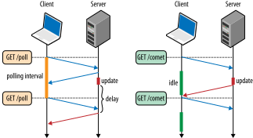

# 15장 - [XML Http Request](https://hpbn.co/xmlhttprequest/)

> 웹에서 콘텐츠를 로드하는 방식과 사용자 경험의 변화

기존 웹 페이지 로딩 방식 (Before XHR)

- 초기 웹은 정적인 문서 위주였고, 사용자가 어떤 작업(예: 버튼 클릭)을 할 때마다 전체 페이지를 다시 로드해야 했습니다.
- 이 방식은 느리고 비효율적이며, 사용자 경험을 저하시켰습니다.
- 예를 들어, 게시글을 읽다가 "다음 페이지" 버튼을 누르면 화면 전체가 다시 로딩되었습니다.

더 나은 사용자 경험을 위한 노력

- 더 부드럽고 빠른 사용자 경험을 제공하기 위해, 전체 페이지를 새로 고치지 않고 필요한 데이터만 받아올 수 있는 기술이 필요했습니다.
  - 연결 관리: 연결 설정, 재사용(커넥션 풀링), 종료 등을 브라우저가 관리합니다.
  - 전송 방식 선택: HTTP/1.0, 1.1, 2 중에서 최적의 프로토콜을 자동으로 선택합니다.
  - HTTP 기능 처리: 캐싱, 리디렉션, 콘텐츠 타입 협상 등을 브라우저가 알아서 처리합니다.
  - 보안 및 개인정보 보호: 인증, 보안 정책, 개인정보 보호와 관련된 제약들을 브라우저가 강제합니다.
- 이 과정에서 등장한 기술이 **비동기 JavaScript와 XML(Ajax)**입니다.

Ajax 등장 전의 해결책들

- Ajax가 등장하기 전에도 일부 방법들이 있었지만, 복잡하거나 브라우저 호환성이 낮았고, 구현이 까다로웠습니다.
- 예를 들어, `<iframe>`이나 이미지 비콘(image beacon)을 활용한 트릭성 데이터 요청이 있었습니다.

## XMLHttpRequest(XHR)의 간략한 역사

- **XMLHttpRequest는 마이크로소프트가 1999년 IE 5에 처음 도입**했습니다.

  - 원래 이름은 **XMLHTTP ActiveX 객체**였고, MS Outlook Web Access에서 빠르게 이메일 UI를 구현하기 위해 만들어졌습니다.

- 이후 **다른 브라우저들도 이를 채택**했으며, 결국 **XHR은 웹 표준의 일부가 되었습니다**.

- **2005년**, 구글이 XHR을 사용한 **Gmail과 Google Maps**를 선보이면서 이 기술이 널리 알려졌고, 이때부터 **Ajax (Asynchronous JavaScript and XML)** 라는 용어가 탄생했습니다.

- Ajax의 핵심은:

  - **전체 페이지를 새로 고치지 않고**,
  - **비동기적으로 서버와 데이터를 주고받는 방식**입니다.

* 이후 **XMLHttpRequest Level 2**, 줄여서 **XHR2**가 등장하며 기능이 크게 확장되었습니다.

  - 예를 들어:
    - **파일 업로드 (FormData 지원)**
    - **CORS (Cross-Origin Resource Sharing)**
    - **바이너리 데이터 전송 (ArrayBuffer, Blob 등)**
    - **진행 상황 추적 (upload progress events)**

* 하지만 시간이 지나면서 **레벨 1과 레벨 2의 구분이 사실상 사라졌고**,
  **현대의 XMLHttpRequest는 대부분 XHR2의 기능을 포함**합니다.

따라서 오늘날 **"XMLHttpRequest"라고 하면 보통 XHR2를 의미**한다고 보면 됩니다.

## 교차 출처 리소스 공유 (Cross-Origin Resource Sharing, CORS)

### 기본 보안 정책: 동일 출처 정책(Same-Origin Policy)

- 브라우저는 보안을 위해 **동일 출처(same-origin)**의 리소스만 자바스크립트로 접근할 수 있도록 제한합니다.

  - 예를 들어, `example.com` 페이지에서 `api.example.com` 요청은 기본적으로 **차단**됩니다.

오리진(origin)은 웹에서 ‘프로토콜’, ‘도메인 이름’, ‘포트 번호’의 세 가지로 구성된 집합을 의미합니다.
즉, (http, example.com, 80)과 (https, example.com, 443)은 프로토콜 또는 포트가 다르기 때문에 서로 다른 오리진으로 간주됩니다.

### 이를 해결하는 표준: CORS

- **CORS (Cross-Origin Resource Sharing)**는 **다른 출처의 리소스에 안전하게 접근할 수 있도록 해주는 opt-in(선택적 허용) 메커니즘**입니다.
- 서버가 **특정 출처에 대해 요청을 허용하겠다고 명시**하면, 브라우저는 이를 허용합니다.

```js
// script origin: (http, example.com, 80)
var xhr = new XMLHttpRequest();
xhr.open('GET', '/resource.js'); // Same-origin XHR request
xhr.onload = function() { ... };
xhr.send();

var cors_xhr = new XMLHttpRequest();
cors_xhr.open('GET', 'http://thirdparty.com/resource.js');  // Cross-origin XHR request
cors_xhr.onload = function() { ... };
cors_xhr.send();
```

### 작동 방식 요약

1. **간단한 요청(simple request)**

   - 브라우저가 요청을 보낼 때 `Origin` 헤더를 포함시킵니다.
   - 서버가 `Access-Control-Allow-Origin` 헤더로 응답합니다.
   - 예:

```
=> Request
GET /resource.js HTTP/1.1
Host: thirdparty.com
Origin: http://example.com // origin header
...

<= Response
HTTP/1.1 200 OK
Access-Control-Allow-Origin: http://example.com // 서버가 Opt-in header 설정
...
```

2. **사전 요청(preflight request)**

   - `PUT`, `DELETE`, 사용자 정의 헤더 등 **단순하지 않은 요청**은 사전 확인 요청을 보냅니다.
   - 브라우저가 먼저 `OPTIONS` 요청을 보내 허용 여부를 확인합니다.
   - 서버가 허용하면 실제 요청을 보냅니다.

### CORS는 서버가 제어한다

- 브라우저는 **서버가 명시적으로 허용한 경우에만 교차 출처 요청을 허용**합니다.
- 서버가 `Access-Control-*` 헤더를 설정하지 않으면, 브라우저는 요청 결과를 스크립트에 전달하지 않습니다.

## XMLHttpRequest로 데이터 다운로드하기

### XHR로 다양한 형태의 데이터 다운로드 가능

- XHR은 단순한 텍스트뿐만 아니라, **다양한 타입의 데이터**(예: XML, JSON, 바이너리 등)를 다운로드할 수 있습니다.
- 이를 위해 **responseType 속성**을 사용해 기대하는 응답 형식을 지정할 수 있습니다.

### 주요 responseType 값

1. ArrayBuffer: 고정 길이의 이진 데이터 버퍼
2. Blob: 변경할 수 없는 대용량 이진 데이터 객체
3. Document: 파싱된 HTML 또는 XML 문서
4. JSON: 단순 데이터 구조를 나타내는 JavaScript 객체
5. Text: 단순한 텍스트 문자열

### 예시: 이미지 다운로드

- 이미지 파일을 XHR로 다운로드하려면 `responseType = "blob"`을 설정하고,
- 완료 후 `URL.createObjectURL()`을 사용해 이미지를 표시할 수 있습니다.

```javascript
const xhr = new XMLHttpRequest();
xhr.open("GET", "/image.jpg", true);
xhr.responseType = "blob"; // 반환 데이터 타입 설정

xhr.onload = function () {
  if (this.status == 200) {
    const img = document.createElement("img");
    img.src = window.URL.createObjectURL(this.response); // blob에 대한 고유 object URI 생성 후 img의 src로 설정
    img.onload = function () {
      window.URL.revokeObjectURL(this.src); // 로드 완료 후 URI 해제
    };
    document.body.appendChild(img);
  }
};
xhr.send();
```

### 주의사항

- 모든 브라우저가 **모든 responseType을 지원하지는 않습니다.**
  (특히 구형 브라우저는 `"json"`, `"blob"`을 지원하지 않을 수 있습니다.)
- 바이너리 데이터를 처리할 때는 반드시 `responseType`을 명확히 지정해야 합니다.

## XMLHttpRequest로 데이터 업로드하기

### XHR을 통한 데이터 업로드

- XHR은 단순한 GET 요청뿐만 아니라, **POST, PUT 등을 사용한 데이터 업로드도 지원**합니다.
- 특히 **파일 업로드나 폼 데이터 전송** 같은 작업에 유용합니다.

### FormData 객체 사용

- HTML `<form>` 요소 없이도 **JavaScript에서 직접 폼 데이터를 만들고 전송**할 수 있게 해주는 객체.
- 파일과 텍스트 필드를 함께 전송할 수 있으며, **multipart/form-data** 형식으로 자동 인코딩됨.

```javascript
var xhr = new XMLHttpRequest();
xhr.open('POST', '/upload');
xhr.onload = function() { ... };
xhr.send("text string"); // 간단한 텍스트 문자열을 서버에 업로드

var formData = new FormData(); // FormData API를 사용해 동적으로 폼 생성
formData.append('id', 123456);
formData.append('topic', 'performance');

var xhr = new XMLHttpRequest();
xhr.open('POST', '/upload');
xhr.onload = function() { ... };
xhr.send(formData); // multipart/form-data 객체를 서버에 업로드

var xhr = new XMLHttpRequest();
xhr.open('POST', '/upload');
xhr.onload = function() { ... };
var uInt8Array = new Uint8Array([1, 2, 3]); // 부호 없는 8비트 정수로 이루어진 타입 배열(ArrayBuffer) 생성
xhr.send(uInt8Array.buffer); // 바이트 조각(chunk)을 서버에 업로드
```

## 다운로드 및 업로드 진행 상태 모니터링

### XHR는 다운로드와 업로드 모두에 대해 **진행 상황(progress)** 추적을 지원

XHR에서는 개발자가 **데이터가 얼마나 전송되었는지 실시간으로 확인할 수 있는 이벤트**를 제공합니다.

| Event type | Description             | Times fired  |
| ---------- | ----------------------- | ------------ |
| loadstart  | Transfer has begun      | once         |
| progress   | Transfer is in progress | zero or more |
| error      | Transfer has failed     | zero or once |
| abort      | Transfer is terminated  | zero or once |
| load       | Transfer is successful  | zero or once |
| loadend    | Transfer has finished   | once         |

XHR(비동기 HTTP 요청) 전송은 **loadstart** 이벤트로 시작해서 **loadend** 이벤트로 끝나며, 그 사이에 전송 상태를 나타내는 추가 이벤트들이 발생합니다.
따라서 진행 상황을 모니터링하려면 XHR 객체에 여러 JavaScript 이벤트 리스너를 등록하면 됩니다.

```javascript
var xhr = new XMLHttpRequest();
xhr.open('GET', '/resource');
xhr.timeout = 5000; // 요청 타임아웃을 5,000ms로 설정 (기본값: 타임아웃 없음)

xhr.addEventListener('load', function() { ... }); // 요청이 성공했을 때 실행할 콜백 등록
xhr.addEventListener('error', function() { ... }); // 요청이 실패했을 때 실행할 콜백 등록

var onProgressHandler = function(event) {
  if (event.lengthComputable) {
    var progress = (event.loaded / event.total) * 100; // 전송 진행 상황 계산
    ...
  }
};

xhr.upload.addEventListener('progress', onProgressHandler); // 업로드 진행 이벤트에 대한 콜백 등록
xhr.addEventListener('progress', onProgressHandler); // 다운로드 진행 이벤트에 대한 콜백 등록
xhr.send();
```

XHR 전송이 끝나면 `load` 또는 `error` 이벤트 중 하나가 한 번 발생해 최종 상태를 알려줍니다.  
반면, `progress` 이벤트는 여러 번 발생할 수 있으며, `loaded`와 `total` 속성을 비교해 전송된 데이터 양을 쉽게 추적할 수 있습니다.

## XMLHttpRequest로 데이터 스트리밍하기

- 일부 웹 애플리케이션에서는 서버에서 데이터를 스트림 형태(순차적으로 점진적으로 증가하는 데이터)로 받아 처리해야 할 때가 있습니다.
- 하지만 XHR의 `send()` 메서드는 업로드 시 전체 데이터를 한 번에 보내는 것을 전제로 하며, `response`, `responseText`, `responseXML` 속성도 스트리밍 처리를 위해 설계되지 않았습니다.

- 공식 XHR 표준에서는 스트리밍이 주요 유스케이스가 아니었기 때문에, 클라이언트에서 서버로의 스트리밍 업로드를 위한 별도의 API가 존재하지 않습니다. 대신 큰 파일을 여러 조각(청크)으로 나누어 여러 번에 걸쳐 업로드하는 우회 방법만 사용할 수 있습니다.
- 다운로드의 경우, XHR2 표준에서는 서버의 부분(partial) 응답을 읽을 수 있는 기능이 제한적으로 제공되지만, 실제로는 효율적이지 않고 구현도 제한적입니다.
- 즉, XHR만으로는 완전한 스트리밍 업로드/다운로드를 지원하지 않으며, 스트리밍 다운로드 역시 성능과 호환성에 제약이 많습니다.

```javascript
var xhr = new XMLHttpRequest();
xhr.open("GET", "/stream");
xhr.seenBytes = 0;

xhr.onreadystatechange = function () {
  // 상태 및 진행 상황 알림을 구독
  if (xhr.readyState > 2) {
    var newData = xhr.responseText.substr(xhr.seenBytes); // 부분 응답에서 새 데이터 추출
    // process newData

    xhr.seenBytes = xhr.responseText.length; // 처리된 바이트 오프셋 업데이트
  }
};

xhr.send();
```

결론적으로, 브라우저에서 XHR만으로는 완전한 스트리밍 처리가 어렵고, 업로드는 청크 방식, 다운로드는 제한적인 부분 스트리밍만 가능하며, Streams API와의 결합 등 더 나은 스트리밍 지원이 논의되고 있지만 아직 표준화되어 있지 않습니다.

### 한계점

XHR로 스트리밍 데이터를 처리할 때의 주의점과 한계는 다음과 같습니다:

- `responseText`는 전체 응답을 메모리에 버퍼링하므로, 데이터 양이 많거나 메모리가 제한된 환경(예: 모바일)에서는 문제가 될 수 있습니다. 버퍼를 해제하려면 요청을 종료하고 새로 시작해야 합니다.
- 부분 응답(스트리밍 데이터)은 오직 `responseText` 속성을 통해서만 읽을 수 있고, 이는 텍스트 데이터에만 해당됩니다. 바이너리 데이터에 대해서는 부분 응답을 읽을 방법이 없습니다.
- 스트림으로 받은 데이터에서 메시지 경계(데이터 구분점)를 직접 파악해야 하므로, 애플리케이션에서 자체적으로 데이터 포맷을 정의하고 파싱 로직을 구현해야 합니다.
- 데이터가 버퍼링되는 방식이 브라우저마다 다릅니다. 어떤 브라우저는 데이터를 바로 해제하고, 어떤 브라우저는 작은 응답을 모아서 더 큰 덩어리로 해제합니다.
- 순차적으로 읽을 수 있는 `content-type`(콘텐츠 타입)이 브라우저마다 다릅니다. 예를 들어, 어떤 브라우저는 `"text/html"`에서만 허용하고, 다른 브라우저는 `"application/x-javascript"`에서만 동작합니다.
- 표준화된 스펙이 없어서 브라우저마다 동작이 다르고, 구현이 일관되지 않습니다.
- 바이너리 스트리밍은 사실상 불가능합니다.

요약하면, 현재 XHR로 스트리밍을 구현하는 것은 성능, 메모리, 호환성 등 다양한 측면에서 한계가 많으며, 완전한 스트리밍 지원이 필요하다면 다른 기술(Server-Sent Events, WebSocket 등)을 사용하는 것이 더 적합합니다.

## 실시간 알림 및 데이터 전달 (Real-Time Notifications and Delivery)

### Polling with XHR

- 폴링(Polling)은 클라이언트가 일정한 간격으로 서버에 XHR 요청을 보내 새로운 데이터가 있는지 확인하는 방식입니다.
- 이 방식은 구현이 간단하고, 거의 모든 환경에서 동작한다는 장점이 있지만, 서버에 불필요한 요청이 많이 발생해 네트워크와 서버 리소스를 비효율적으로 사용할 수 있습니다.
- 폴링 주기를 짧게 하면 실시간성은 높아지지만, 서버 부하가 증가하고, 너무 길게 하면 실시간성이 떨어집니다.

```js
function checkUpdates(url) {
  var xhr = new XMLHttpRequest();
  xhr.open('GET', url);
  xhr.onload = function() { ... }; // 서버로부터 받은 업데이트를 처리
  xhr.send();
}

setInterval(function() { checkUpdates('/updates') }, 60000); // 60초마다 XHR 요청을 전송
```

### Long-Polling with XHR



- 롱 폴링(Long-Polling)은 클라이언트가 서버에 XHR 요청을 보내고, 서버는 **새로운 데이터**가 생길 때까지 **응답을 지연**시킨 후 데이터를 보내는 방식입니다.
- 서버가 데이터를 준비할 때까지 연결을 유지하므로, 데이터가 도착하면 즉시 클라이언트가 받을 수 있어 실시간성이 높아집니다.
- 응답을 받은 후에는 클라이언트가 즉시 다음 요청을 보내는 방식으로 계속 연결을 유지합니다.
- 롱 폴링은 폴링에 비해 서버와 네트워크 리소스를 더 효율적으로 사용할 수 있지만, 여전히 각 요청마다 새로운 HTTP 연결이 필요하므로 완전한 실시간 양방향 통신(예: WebSocket)에 비해서는 한계가 있습니다.

이 두 방식 모두 XHR의 범용성과 호환성을 바탕으로 실시간 알림이나 데이터 전달에 활용할 수 있지만, 최신 브라우저와 서버 환경에서는 WebSocket, Server-Sent Events 등 더 효율적인 실시간 통신 기술이 선호됩니다.

```js
function checkUpdates(url) {
  var xhr = new XMLHttpRequest();
  xhr.open('GET', url);
  xhr.onload = function() {
    // 받은 업데이트를 처리하고 새로운 롱폴 XHR 요청을 엽니다.
    ...
    checkUpdates('/updates');  // 다음 업데이트를 위해 롱폴 요청을 보냅니다.
  };
  xhr.send();
}

checkUpdates('/updates'); // 최초 롱폴 XHR 요청을 보냅니다.
```

### 정리

| 방식      | 실시간성 | 효율성 | 구현 난이도 | 비고                      |
| --------- | -------- | ------ | ----------- | ------------------------- |
| 일반 폴링 | 낮음     | 낮음   | 쉬움        | 불필요한 트래픽 발생 가능 |
| 롱 폴링   | 높음     | 중간   | 중간        | WebSocket 대안으로 적합   |

<details><summary> 그럼 long-polling이 항상 좋은가? </summary>

롱폴링(long-polling)이 항상 폴링(polling)보다 더 좋은 것은 아닙니다. 각각의 방식에는 장단점이 있으며, 어떤 방식을 선택할지는 애플리케이션의 요구사항과 환경에 따라 달라집니다.

## **폴링과 롱폴링의 차이**

- **폴링**은 클라이언트가 일정한 간격으로 서버에 계속 요청을 보내는 방식입니다. 새로운 데이터가 없어도 계속 요청이 발생하기 때문에 불필요한 네트워크 트래픽과 서버 부하가 커질 수 있습니다.
- **롱폴링**은 클라이언트가 서버에 요청을 보내면, 서버가 새로운 데이터가 생길 때까지 연결을 유지하다가 응답을 보내는 방식입니다. 응답을 받은 클라이언트는 즉시 다음 요청을 보내기 때문에, 불필요한 요청이 줄어들고 더 실시간에 가까운 데이터 전달이 가능합니다.

## **롱폴링이 유리한 경우**

- **네트워크 오버헤드 감소:** 불필요한 빈 응답이 줄어들어 트래픽이 감소합니다.
- **낮은 지연 시간:** 새로운 데이터가 생기면 바로 전달받을 수 있습니다.
- **업데이트가 드물거나 불규칙한 경우:** 빈번한 데이터 갱신이 필요 없을 때 효율적입니다.

## **롱폴링의 한계**

- **서버 자원 소모:** 연결을 오래 유지해야 하므로, 많은 클라이언트가 동시에 접속하면 서버의 메모리와 리소스 사용량이 크게 늘어납니다.
- **확장성 문제:** 수많은 동시 연결을 효율적으로 처리하려면 서버 아키텍처가 복잡해집니다.
- **구현 복잡성:** 타임아웃, 재시도, 연결 관리 등 추가적인 로직이 필요합니다.
- **초저지연/고빈도 실시간 통신에는 부적합:** 웹소켓(WebSocket) 등 더 적합한 프로토콜이 있습니다.

## **폴링이 더 나은 경우**

- **구현이 단순:** 작은 규모나 실시간성이 크게 중요하지 않은 서비스에 적합합니다.
- **예측 가능한 서버 부하:** 요청이 짧게 끝나므로, 서버 리소스 관리가 쉽습니다.

## **비교 표**

| 특징        | 폴링                       | 롱폴링                       |
| ----------- | -------------------------- | ---------------------------- |
| 요청 빈도   | 높음 (고정 간격)           | 낮음 (새 데이터/타임아웃 시) |
| 지연 시간   | 높음 (간격에 따라 다름)    | 낮음 (실시간에 가까움)       |
| 서버 부하   | 높음 (불필요한 요청 많음)  | 연결 유지로 리소스 소모      |
| 확장성      | 소규모에 적합              | 대규모에선 복잡              |
| 구현 난이도 | 쉬움                       | 어려움                       |
| 적합한 용도 | 단순, 실시간성 낮은 서비스 | 실시간, 드문 업데이트 서비스 |

## **결론**

롱폴링은 실시간성이 중요한 경우 폴링보다 효율적이지만, 항상 더 좋은 선택은 아닙니다. 대규모 서비스나 고빈도 실시간 통신에는 웹소켓 등 더 적합한 대안이 있습니다. 애플리케이션의 요구사항, 규모, 인프라 환경을 고려해 적절한 방식을 선택하는 것이 중요합니다.

</details>

## XHR 사용 사례와 성능 (XHR Use Cases and Performance)

### XHR 사용 사례와 성능

**XMLHttpRequest(XHR)**는 자바스크립트에서 서버와 데이터를 주고받을 수 있게 해주는 브라우저 API입니다. XHR의 등장으로 웹페이지 전체를 새로고침하지 않고도 비동기적으로 데이터를 주고받을 수 있게 되었고, 이로 인해 AJAX 기반의 동적 웹 애플리케이션이 가능해졌습니다. XHR은 다음과 같은 장점과 특징을 가지고 있습니다.

#### **주요 사용 사례**

- **스크립트 기반 다운로드/업로드**: 텍스트, 바이너리, 파일 등 다양한 데이터를 전송할 수 있으며, 파일 업로드도 효율적으로 지원합니다.
- **스트리밍 및 실시간 알림**: 실시간 데이터 수신(롱 폴링 등)에도 활용됩니다.
- **범용 네트워킹 도구**: 거의 모든 브라우저에서 지원되며, 다양한 네트워크 작업에 폭넓게 사용됩니다.

#### **성능 및 동작 특징**

- **브라우저가 저수준 네트워크 관리**: 연결, 프로토콜 협상, HTTP 요청 포맷팅, 캐싱, 리다이렉트, 콘텐츠 협상, 보안, 인증 등 대부분을 브라우저가 자동으로 처리합니다.
- **비동기 요청 지원**: 페이지 상태를 유지하면서 서버와 데이터를 주고받을 수 있습니다.
- **간단한 API**: 복잡한 네트워크 세부사항을 신경 쓰지 않고 비즈니스 로직에 집중할 수 있습니다.
- **다양한 데이터 타입 지원**: 텍스트뿐만 아니라 ArrayBuffer, Blob, FormData 등 다양한 형식의 데이터 송수신을 지원합니다.
- **진행 상황 모니터링**: 업로드/다운로드 진행 상황을 이벤트로 감지할 수 있습니다.

#### **제약 및 주의점**

- **최적의 전송 방식은 아님**: 모든 상황에서 XHR이 가장 효율적인 것은 아니며, 최신 브라우저에서는 Fetch API, WebSocket 등 더 나은 대안이 있을 수 있습니다.
- **레거시 지원**: 최신 API를 사용할 수 없는 구형 브라우저에서는 여전히 XHR이 널리 사용됩니다.

**정리:**  
XHR은 웹 애플리케이션에서 거의 모든 네트워킹 작업에 활용될 수 있는 범용적인 도구이지만, 항상 최고의 성능을 보장하는 것은 아닙니다. 최신 기능과 성능이 중요한 경우, 상황에 따라 더 적합한 API를 선택하는 것이 좋습니다.
