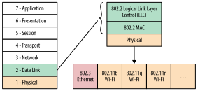

# 6장 WiFi

- WiFi는 비허가 ISM 스펙트럼에서 작동하며, 누구나 쉽게 저렴하게 배포할 수 있다는 점에서 간단하고 비용 효율적
- "WiFi"는 WiFi Alliance의 (이름+로고) 상표이지만, 실질적으로 IEEE 802.11 표준을 기반으로 한 장치면 상관 없이 사용 된다.
- 최초의 802.11 프로토콜은 1997년에 소개되었으며, Ethernet 표준(IEEE 802.3)을 무선 통신에 적응시킨 것

## 이더넷에서 무선 LAN으로 (From Ethernet to a Wireless LAN)

- 802.11 무선 표준은 기존 이더넷(802.3) 표준을 확장 및 적응시킨 형태로 설계되었습니다.
- 이더넷이 일반적으로 LAN 표준으로 알려져 있다면, 802.11 계열은 무선 LAN(WLAN)으로 불립니다
- 역사적으로 이더넷 프로토콜은 1971년 하와이 대학교에서 개발된 최초의 공공 무선 네트워크인 ALOHAnet에서 영감을 받았습니다.
  - [이더넷통신의 발명](https://blog.naver.com/emccorea/223304248979)

ALOHA, 이더넷, WiFi 프로토콜은 모두 공유 매체를 "랜덤 액세스 채널"로 간주합니다. 이는 특정 장치나 프로세스가 데이터 전송을 `중앙에서 제어`하지 않고, 각 장치가 독립적으로 결정하며 협력하여 채널 성능을 보장해야 함을 의미합니다.

### 이더넷

이더넷은 확률적 캐리어 감지 다중 액세스(CSMA, probabilistic carrier sense multiple access) 프로토콜을 사용하며, 이는 "말하기 전에 듣는다"는 간단한 알고리즘입니다. 데이터를 보내려면 다음 단계를 따릅니다:

- 다른 장치가 데이터를 전송 중인지 확인합니다.
- 채널이 사용 중이라면 비어질 때까지 대기합니다.
- 채널이 비어 있으면 즉시 데이터를 전송합니다.

그러나 신호 전파에 시간이 걸리므로 충돌이 발생할 수 있습니다. 이를 해결하기 위해 이더넷은 충돌 감지(CSMA/CD, collision detection)를 추가했습니다. 충돌이 감지되면 양측은 즉시 전송을 중단하고 랜덤한 시간 동안 대기함으로써 동기화된 재전송을 방지합니다.

- **CSMA(Carrier Sense Multiple Access)**: 장치가 데이터를 보내기 전에 **채널이 비어 있는지(사용 중인지)** 먼저 확인하고, 비어 있으면 전송하고, 사용 중이면 기다리는 방식입니다. 한마디로, "**지금 말해도 되나?**" 하고 먼저 살펴보고 말하는 방식이죠.

### WiFi

WiFi는 유사하지만 약간 다른 모델을 따릅니다. 하드웨어 제한으로 인해 WiFi는 데이터 전송 중 충돌을 감지할 수 없습니다. 대신 WiFi는 충돌 회피(CSMA/CA)를 사용하며, 송신자는 채널이 유휴 상태일 때만 데이터를 전송하고 전체 메시지 프레임을 한 번에 보냅니다. 송신 후에는 수신자로부터 명시적인 확인 응답을 기다린 뒤 다음 전송을 진행합니다.

이러한 기술 조합은 이더넷과 WiFi가 공유 매체 접근을 규제하는 방식입니다. 이더넷에서는 물리적 와이어가 매체이고, WiFi에서는 공유 라디오 채널이 매체입니다.

실제로 확률적 접근 모델은 네트워크 부하가 적을 때 매우 잘 작동합니다. 채널 활용도를 높이고 충돌 수를 최소화하려면 채널 부하를 `10%` 이하로 유지해야 합니다. 부하가 낮으면 명시적인 조정이나 스케줄링 없이도 좋은 처리량을 얻을 수 있지만, 부하가 증가하면 충돌 수가 급격히 증가하여 네트워크 성능이 불안정해질 수 있습니다.

혼잡한 WiFi 네트워크(예: 컨퍼런스 홀)에서 많은 동료들이 액세스를 경쟁하는 상황에서는 불안정한 WiFi 성능을 경험할 가능성이 높습니다. 이러한 문제는 확률적 스케줄링 외에도 여러 요인이 작용하지만, 확률적 접근 방식도 중요한 역할을 합니다.

## WiFi 표준 및 기능 (WiFi Standards and Features)

WiFi는 `1999년` 802.11b 표준의 도입으로 대중화되었으며, 이후 IEEE 802 표준 위원회는 더 높은 처리량, 개선된 변조 기술, 멀티 스트리밍 등 다양한 기능을 추가한 새로운 프로토콜을 지속적으로 개발해왔습니다. 초기 802.11b는 `2.4GHz` 대역에서 작동하며, 최대 데이터 속도가 스트림당 `11Mbps`였습니다.

https://ko.wikipedia.org/wiki/IEEE_802.11

- 전송 방식 표준 참고

- [WiFi 5 vs 6](https://www.tp-link.com/kr/blog/382/wifi-5-vs-wifi-6-%EC%96%B4%EB%96%A4-%EC%B0%A8%EC%9D%B4%EC%A0%90%EC%9D%B4-%EC%9E%88%EC%9D%84%EA%B9%8C%EC%9A%94-/)

예) [쿠팡 공유기](https://www.coupang.com/np/search?component=&q=%EA%B3%B5%EC%9C%A0%EA%B8%B0&channel=user)

## WiFi 성능 측정 및 최적화 (Measuring and Optimizing WiFi Performance)

WiFi 네트워크는 널리 사용되면서 성능 문제를 초래하는 주요 원인인 셀 간 및 셀 내부 간섭을 겪습니다. WiFi는 중앙 스케줄러가 없기 때문에 클라이언트에게 처리량이나 지연 시간에 대한 보장을 제공하지 않습니다. WiFi 멀티미디어(WMM) 확장은 음성, 비디오 등 지연 시간에 민감한 애플리케이션을 위해 기본적인 QoS(서비스 품질)를 제공하지만, 이를 지원하는 라우터와 클라이언트는 여전히 드뭅니다. 따라서 네트워크 내부 트래픽뿐 아니라 주변 WiFi 네트워크의 트래픽도 동일한 라디오 자원을 놓고 경쟁해야 합니다.

### 2.4GHz 대역의 한계

WiFi의 가장 널리 사용되는 2.4GHz 대역은 세 개의 비중첩 채널(1, 6, 11)만 제공합니다. 일부 국가에서는 더 높은 채널(13, 14)을 허용하기도 하지만, 대부분의 경우 두세 개 이상의 인근 네트워크가 존재하면 채널이 중첩되어 동일한 주파수 대역에서 대역폭을 놓고 경쟁하게 됩니다. 예를 들어, 802.11g 클라이언트와 라우터가 최대 54Mbps 속도를 지원하더라도 이웃이 동일한 채널에서 HD 비디오를 스트리밍하면 대역폭이 절반 이하로 감소할 수 있습니다. 이는 설계상의 특징이지 결함이 아닙니다.

First Hop Latency

| Freq (GHz) | Median (ms) | 95% (ms) | 99% (ms) |
| ---------- | ----------- | -------- | -------- |
| 2.4        | 6.22        | 34.87    | 58.91    |
| 5          | 0.90        | 1.58     | 7.89     |

### WiFi 성능 특성 요약

- WiFi는 사용자에게 처리량이나 지연 시간 보장을 제공하지 않습니다.
- WiFi는 환경 내 신호 대 잡음비에 따라 가변적인 처리량을 제공합니다.
- 송신 전력은 일반적으로 200mW 이하로 제한됩니다.
- WiFi는 제한된 스펙트럼(2.4GHz 및 5GHz)을 사용합니다.
- 액세스 포인트는 채널 할당이 중첩되도록 설계되었습니다.
- 액세스 포인트와 클라이언트는 동일한 라디오 채널에 대한 접근을 놓고 경쟁합니다.

## WiFi 네트워크에서의 패킷 손실 (Packet Loss in WiFi Networks)

WiFi 네트워크는 확률적 스케줄링 방식으로 데이터를 전송하기 때문에 여러 무선 장치 간 충돌이 자주 발생할 수 있습니다. 그러나 이러한 충돌이 반드시 높은 TCP 패킷 손실로 이어지는 것은 아닙니다. WiFi 프로토콜의 데이터 및 물리 계층은 자체적인 재전송 및 오류 수정 메커니즘을 포함하고 있어, 이러한 충돌의 영향을 상위 네트워킹 계층에서 숨길 수 있습니다.

802.11n 이전에는 WiFi 프로토콜이 한 번에 최대 하나의 전송 중인 프레임만 허용했으며, 다음 프레임을 보내기 전에 해당 프레임이 링크 계층에서 ACK(확인 응답)를 받아야 했습니다. 802.11n(WiFi 4)에서는 새로운 "프레임 집계" 기능이 도입되어 여러 WiFi 프레임을 동시에 전송하고 한 번에 ACK를 받을 수 있게 되었습니다.

결과적으로, WiFi에서 관찰되는 TCP 패킷 손실률은 대부분 유선 네트워크와 비슷한 수준이며, `TCP 패킷 손실`보다는 `패킷 도착 시간의 변동성`이 더 큰 문제로 나타납니다.

### WiFi 네트워크 최적화 (Optimizing for WiFi Networks)

WiFi는 성능 보장 없이도 대부분의 경우 “충분히 잘 작동”하며, 유선 연결보다 편리함을 제공하기 때문에 널리 사용됩니다. 오늘날 대부분의 장치가 WiFi를 기본으로 지원하며, 유선 연결을 위해 추가 주변 장치를 필요로 하는 경우가 더 흔합니다. 따라서 애플리케이션이 WiFi 환경에서 최적화될 수 있다면 이를 고려하는 것이 중요합니다.

### WiFi의 비계량 대역폭 활용 (Leverage Unmetered Bandwidth)

WiFi 네트워크는 종종 유선 LAN의 확장 형태로 배포되며, DSL, 케이블, 또는 광섬유를 통해 광역 네트워크(WAN)에 연결됩니다. 대부분의 WiFi 사용자는 WAN 대역폭 제한을 경험하며, 이는 WiFi 자체가 아닌 WAN 연결의 속도에 의해 좌우됩니다.

그러나 일반적인 WiFi 배포는 대개 비계량(unmetered) WAN 연결을 기반으로 하거나 높은 데이터 캡과 최대 처리량을 제공하는 연결을 지원합니다. 이는 3G/4G 연결에서 발생하는 데이터 제한 및 비용 문제를 완화하며, 대규모 다운로드, 업데이트, 스트리밍 작업을 수행하기에 적합합니다.

### 가변 대역폭에 적응하기 (Adapt to Variable Bandwidth)

WiFi 네트워크는 환경적 요인에 따라 대역폭이 크게 변동할 수 있으므로, 애플리케이션은 이를 고려해 설계되어야 합니다. WiFi는 대역폭 보장을 제공하지 않으며, 사용 가능한 대역폭은 무선 환경의 신호 대 잡음비(SNR), 주변 네트워크 활동, 사용 위치 등 다양한 요인에 의해 영향을 받습니다. 특히 HD 비디오 스트리밍과 같은 작업은 몇 Mbps 이상의 안정적인 대역폭을 요구하지만, WiFi 환경에서는 간헐적인 처리량 감소가 발생할 가능성이 높습니다.

| Video Resolution | Min Bitrate (Mbit/s) | Max Bitrate (Mbit/s) |
| ---------------- | -------------------- | -------------------- |
| 360p             | 0.5                  | 0.5                  |
| 480p             | 1.0                  | 1.5                  |
| 720p             | 2.0                  | 2.9                  |
| 1080p            | 3.0                  | 4.3                  |

#### 적응형 비트레이트 스트리밍

적응형 비트레이트 스트리밍(Adaptive Bitrate Streaming): 주로 비디오와 오디오 같은 장시간 재생되는 콘텐츠에 적합한 기술입니다.

- 비디오를 여러 비트레이트로 인코딩하여 저장한 뒤, 이를 5~10초 정도의 작은 세그먼트로 분할
- 클라이언트가 데이터를 스트리밍하는 동안, 클라이언트나 서버가 각 세그먼트의 다운로드 속도를 모니터링하여 다음 세그먼트의 비트레이트를 동적으로 조정함으로써 네트워크 대역폭 변화에 대응
- 일반적으로 스트리밍 서비스는 빠른 재생 시작을 위해 낮은 비트레이트로 초기 재생을 시작한 후, 가용 대역폭에 따라 이후 세그먼트의 비트레이트를 지속적으로 조정
- 예를 들어, 넷플릭스는 다양한 화면 크기와 대역폭 조건에 맞추기 위해 하나의 스트림을 120가지 이상의 버전으로 인코딩해 제공

### 가변 지연 시간에 적응하기(Adapt to Variable Latency)

WiFi 환경에서는 대역폭뿐만 아니라 첫 번째 무선 홉의 지연 시간(latency)도 보장되지 않으며, 무선 브리지(릴레이) 액세스 포인트를 사용하는 경우처럼 여러 무선 홉이 필요한 상황에서는 예측 가능성이 더욱 낮아진집니다.

- 

이상적인 조건에서는 간섭이 최소화되고 네트워크 부하가 적을 때 무선 홉의 지연 시간이 1밀리초 미만으로 매우 낮고 안정적일 수 있습니다. 그러나 실제로는 고밀도 도시나 사무실 환경에서 수십 개의 WiFi 액세스 포인트와 기기들이 동일한 주파수 대역을 경쟁적으로 사용하면서 1-10밀리초의 중간값 지연 시간과 함께 10-50밀리초, 심지어 수백 밀리초에 이르는 높은 지연 시간이 발생할 수 있습니다.

지연 시간에 민감한 애플리케이션이라면 WiFi 네트워크에서 동작할 때의 특성을 신중히 고려해야 합니다. 이를 위해 WebRTC와 같은 UDP 기반의 비신뢰성 전송 방식을 활용하는 것도 하나의 방법이 될 수 있습니다. 이는 무선 네트워크 자체의 문제를 해결하지는 못하지만, 프로토콜 및 애플리케이션에서 발생하는 추가적인 지연 시간을 줄이는 데 도움을 줄 수 있습니다.
