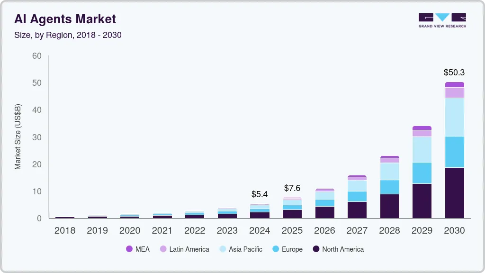

# AI 에이전트가 만드는 세상

## 1.1. AI 란?

AI(Artificial Intelligence): 인간의 지능적 사고와 **학습 능력**을 모방하여 구현한 컴퓨터 시스템

- 데이터로부터 스스로 규칙을 발견하고 적용

예) 스팸 메일 필터링 시스템

이전

```
if "당첨 in 이메일_제목 or ... or "모료" in 이메일_제목 or "특가" in 이메일_제목:
    분류 = "스팸"
else:
    분류 = "정상"
```

학습 기반 AI는 수천 개의 스팸과 정상 메일 예시를 분석하여 스스로 패턴을 찾아내고, 새로운 유형의 스팸도 효과적으로 식별할 수 있다.

- 학습 능력은 데이터를 통해 패턴을 인식하고, 경험을 축적하여 성능을 개선하는 과정에서 차이를 드러낸다.

AI 학습 방법/형태

- 지도학습 (supervised learning): 정답이 분류된 데이터를 통해 입력/출력 사이의 관계를 배우는 방식. "입력 -> 예측 -> 실제 정답과 비교 -> 오차 계산 -> 업데이트" 과정 반복
- 비지도 학습 (unsupervised learning): 데이터 자체의 구조와 패턴을 발견하는 방식. 정답 없이 데이터의 내재된 특성을 찾아낸다. 데이터의 분포 자체를 이해하고, 유사성이나 차이점을 효과적으로 표현하는 방향으로 진행.
- 강화 학습 (reinforced learning): 환경과 상호작용을 통해 보상(좋은 행동에 대한 긍정적 신호)을 최대화하는 행동을 학습. 시행착오를 통한 학습.

AI 학습에는 일반적으로 대량의 데이터가 필요하다.

- 복잡한 패턴을 정확히 파악하기 위해 다양한 사례를 접해야 한다
- 학습 데이터에만 지나치게 최적화 되는 [과적합(overfitting)](https://developers.google.com/machine-learning/crash-course/overfitting/overfitting?hl=ko) 문제를 줄인다
- 다양한 상황에 적용 가능한 일반화된 규칙을 학습하는데 도움

적은 수의 데이터만으로도 새로운 작업을 학습할 수 있는 [퓨샷 러닝(few-shot learning)](https://www.ibm.com/kr-ko/think/topics/few-shot-learning)과 같은 기술을 활발히 연구하고 있지만, 현재로서는 적은 데이터로만 학습하는 AI의 성능에는 제한이 있다.

이제 AI가 무엇인지 이해했다면, 다음으로 '에이전트'라는 개념을 살펴보자. AI 에이전트를 이해하기 위해서는 먼저 에이전트 자체가 무엇인지 알아야 한다.

## 1.2 에이전트란?

에이전트(agent): 특정 환경 안에서 스스로 판단하고 행동하여 독립적인 역할을 수행하는 존재

- 대리인 또는 대행자와 비슷한 개념
- 예) 부동산 중개인이 집주인을 대신해 집을 판매, 여행사 직원이 여행객을 대신해 항공권과 호텔을 예약
- 주어진 목표를 달성하기 위해 해야 할 작업을, 정해진 규칙이나 알고리즘에 기반해 자율적으로 수행
- 환경과 상호작용하는 방식으로 작용
  - 환경(environment): 에이전트가 존재하고 작업을 수행하는 공간이나 상황
  - 디지털 세계에서 환경은 컴퓨터 시스템, 네트워크, 웹사이트 등
- 반복적이고 규칙적인 작업을 자동으로 처리함으로써, 인간의 시간과 노력을 절약

그렇다면 일반적인 에이전트와 AI 에이전트는 어떤 차이가 있을까? 둘 다 자율적으로 작업을 수행한다는 점에서는 비슷하지만, AI 에이전트는 훨씬 더 높은 수준의 지능과 적응력을 가지고 있다.

## 1.3 AI 에이전트의 등장

AI 에이전트는 사실 에이전트라는 더 큰 개념 안에 포함되는 하나의 유형

- 에이전트: 다양한 역할을 수행할 수 있는 자율적인 소프트웨어
- AI 에이전트: 전통적인 에이전트 개념에 인공지능 기술을 접목한 것으로, 보다 높은 수준의 자율성과 적응력을 갖춘 소프트웨어 시스템

미리 정의된 규칙에 따라 행동하는 규칙 기반의 에이전트는 복잡한 상황에 적절히 대응하지 못하는 한계
-> 다양한 경험을 통해 학습함으로써, **복잡한 상황**에서도 적용 가능

예) 규칙 기반 에이전트

- 에이전트 - 미리 정의된 몇 가지 교통 패턴에만 대응
- AI 에이전트 - 실시간으로 변화하는 다양한 교통 상황, 날씨, 특별 행사와 같은 여러 변수를 고려하여 더 효율적인 신호 체계 구현

AI 기술로 인해

- 복잡하고 불확실한 환경에서도 스스로 판단하고 행동
- 강화 학습을 통해 단기적인 보상뿐만 아니라 장기적인 목표를 고려한 의사결정이 가능
- 복잡한 계획을 수립하고, 여러 단계에 걸친 행동을 조율할 수 있도록 한다

기존의 전통적인 에이전트에 없었던 혁명적인 자율성을 부여한 이유:

- 대규모 언어 모델 (large language model, LLM): 수많은 텍스트 데이터로 다음 단어나 문장을 예측하도록 학습한 거대한 규모의 AI 모델
- 문맥 내 학습(in-context learning): 사전에 명시적으로 프로그래밍되거나 훈련되지 않은 새로운 작업이나 상황에 대해 현재 상황을 기반으로 적절한 행동을 유추해내는 능력

### AI 에이전트의 실제 활용 사례

예) 고객 서비스 AI 에이전트

- 전통적인 챗봇: 미리 정해진 질문과 답변 패턴만 처리 가능
- AI 에이전트: 고객의 복잡한 요구사항을 이해하고, 필요시 여러 시스템(주문 관리, 재고 확인, 결제 처리)에 접근하여 종합적인 해결책을 제시. 고객의 과거 구매 이력, 선호도, 현재 상황을 종합적으로 분석하여 개인화된 서비스 제공

이러한 AI 에이전트는 단순히 정보를 제공하는 것을 넘어서, 실제로 문제를 해결하는 '행동하는 AI'로 진화하고 있다.

최근에는 AI 에이전트끼리 협력을 통해, 더 복잡하고 고도화된 일을 처리하려는 시도가 많아지고 있다. 각 AI 에이전트가 역할을 분담하고, 특화된 영역을 담당하며 상호작용함으로써, 고차원적인 작업을 처리할 수 있게 되는 것이다.

- AI 에이전트 협업의 표준-구글의 A2A 프로토콜 https://brunch.co.kr/@harryban0917/353


