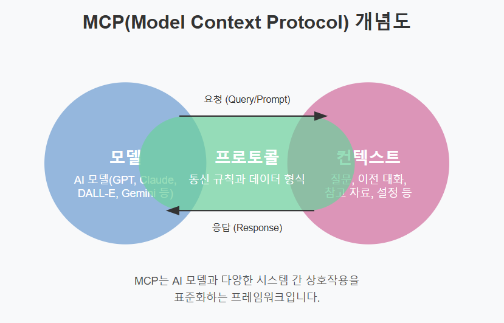
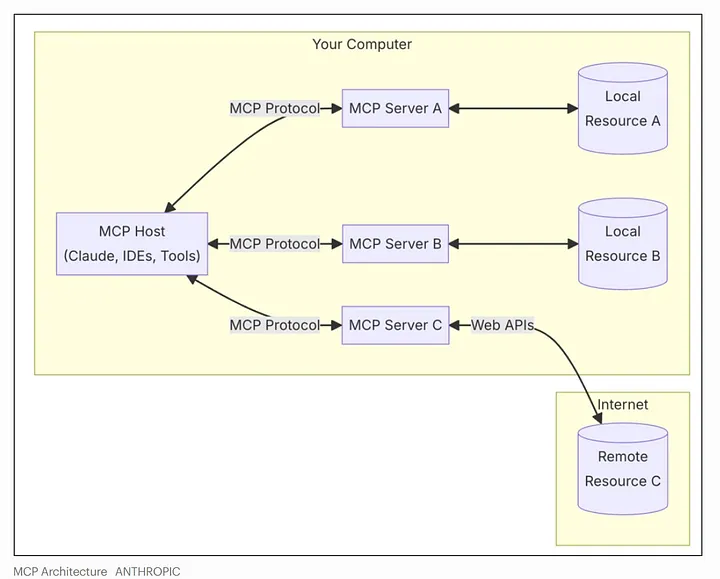

# AI 에이전트를 가능하게 하는 MCP

최근 챗GPT나 Claude 같은 AI 챗봇들이 인기를 끌고 있지만, 이들은 종종 최신 정보에 접근하지 못하거나, 특정 작업을 직접 수행하는 데 한계가 있다 -> MCP 개발

MCP는 AI 모델의 외부의 다른 시스템과 소통할 떄 사용하는 **표준화**된 방식이다.

- 예) MCP를 통해 AI는 파일 시스템에 접근하거나, 데이터베이스를 검색하거나, 웹에서 정보를 가져오는 등의 작업을 수행
- MCP는 AI 모델과 다양한 도구를 연결해주는 **'어댑터'**와 같다. Claude가 날씨 정보가 필요하면 MCP를 통해 날씨 API에 접근, 코드 실행이 필요하다면 코드 실행 도구에 접근.

## 2.1 프로토콜이란?

프로토콜(protocol): 컴퓨터나 원거리 통신 장비 사이에서 메시지를 주고받는 양식과 규칙의 체계

예) 사람들이 대화할 때 암묵적인 프로토콜

- 한 사람이 말하면, 다른 사람은 듣는다
- 질문을 하면, 대답을 기대한다
- 대화를 시작할 때는 인사를 한다
- 대화를 끝낼 떄는 작별 인사를 한다.

IT 분야에서 프로토콜: 서로 다른 기기나 시스템이 '대화'할 수 있도록 하는 공통 언어와 규칙

우리가 흔히 사용하는 HTTP는 웹의 통신을, 블루투스는 기기 간 연결을 가능하게 했듯이, AI 시대에도 AI와 외부 시슽메을 열결할 수 있는 프로톸ㄹ이 필요하다

이러한 필요성에 의해 앤트로픽(Antrhopic)은 MCP라는 프로토콜 개념을 제안했다.

## 2.2 MCP가 필요한 이유

AI는 텍스트 생성, 이미지 편집, 언어 번역 등 다양한 작업을 수행할 수 있지만, 여전히 많은 한계가 존재한다.

큰 문제: 대부분의 AI는 외부 세계와 단절된 채로 작동한다. 실시간 정보를 얻거나 다른 시스템과 상호작용하는 능력이 제한된다는 의미이다

정보의 한계 -> AI의 유용성을 크게 제한 + AI가 실행할 수 있는 작업의 범위도 제한

한계를 극복하기 위해 일부 기업들은 나름의 자체적인 해결점을 제시하고 있다

- 챗GPT의 웹 브라우징 기능, Perplexity와 같은 서비스는 AI에 인터넷 검색 기능을 부여해 최신 정보에 접근할 수 있게 한다

하지만 이와 같은 기능들은 기업마다 독자적인 방식으로 구현되어 호환성이 부족하다. 오픈AI, 앤트로픽, 구글 등 각 AI 깅버은 외부 연결 기능ㅇ르 독자적인 방식으로 개발하고 있기 때문에, 개발자가 여러 AI 시스템에 동일한 기능을 구현하려면 각각 다른 방식으로 작업해야 한다

- 과거 스마트폰 제조사마다 다른 충전 케이블을 사용하던 때의 불편함과 유사

MCP 등장

- AI 산업에서 중요한 이유는 '확장성'
- 확장성이란, 시스템이나 제품에 새로운 기능이나 부품을 쉭베 추가할 수 있는 능력을 의미흐마로, MCP를 통해 AI에 새로운 기능을 '쉽게' 추가할 수 있따
- MCP가 활용하면 누구나 새로운 도구를 개발하여 AI에 연결 할 수 있따.
- AI가 여러 앱과 서비스에 접근할 수 있게 되면, '내일 회의 시간에 맞춰 알람 설정해줘'나 '지난달 식비 얼마나 썻는지 계산해줘'와 같은 복잡한 요청 처리 가능

## 2.3 MCP가 만들어가는 세상

> AI 기술 활용의 민주화
> 고성능 AI 모델을 누구나 '쉽게' 활용할 수 있게 함으로써, 소규모 스타트업이나 개인 개발자도 MCP를 통해 자신의 도메인 지식과 데이터를 최신 AI 모델에 연결해 혁신적인 aI 솔류션을 만든다

예) 자동차 제조사가 MCP를 도입한 경우: 오늘 A라인에서 분량률이 왜 증가했지?

MCP를 통해 분리된 데이터들과 AI를 쉽게 연결 할 수만 있다면, 공장 관리자는 Claude나 챗GPT 같은 강력한 AI를 통해 모든 시스템에 한 번에 접근할 수 있따.
AI는 품질 관리 데이터, 장비 센서 데이터, 작업자 로그, 원자재 정보 등을 도잇에 분석하여 "3번 용접 로봇의 정밀도가 10% 하락했고, 오전 11시부터 온도가 5도 상승했습니다. 정비가 필요합니다" 와 같은 통합적이고 실용적인 답변을 제공할 수 있게 된다.

MCP가 만들어가는 세상은 분리되어 있던 AI 시스템과 외부 서비스가 서로 연결되어, 더 통합된 지능형 환경을 제공하는 세상이다.
각각의 AI는 자신이 가진 전문성과 강점을 유지하면, 다른 서비스에서 필요한 정보를 받아오고, 외부 시스템을 제어해 더욱 복잡한 문제를 해결할 수 있다.

## 2.4 MCP의 구성 요소

MCP Host(호스트)

- 사용자 인터페이스를 제공하고 전체 시스템을 관리
- 사용자가 직접 상호작용하는 주체
- 여러 클라이언트를생성하고 관리
- 예) Claude Desktop, IDE, AI 도구 같은 AI 응용 프로그램

MCP Clients(클라이언트)

- 각 서버와 1:1로 연결되어 데이터를 요청하고 결과를 받아오는 역할
- 여러 서버에 각각 클라이언트가 필요
- 예) Claude Agent, IDE 내부의 연결 모듈 등

MCP Servers(서버)

- 실제로 데이터를 제공하거나 도구 기능을 수행하는 프로그램
- 로컬(내 컴퓨터)이나 원격(인터넷) 어디에나 있을 수 있음
- 예) 파일 서버, 데이터베이스 서버, 번역 서버 등

Local Data Sources(로컬 데이터 소스)

- 내 컴퓨터에 저장된 파일, 데이터베이스 등 MCP 서버가 접근할 수 있는 자원
- 예) 내 컴퓨터의 문서, 사진, 엑셀 파일 등

Remote Services(원격 서비스)

- 인터넷을 통해 접근하는 외부 시스템(API 등)으로, MCP 서버가 연결해서 데이터를 갖고옴
- 예) 날씨 API, 뉴스 사이트, 이메일 서비스 등

### MCP 서버

> AI가 외부 세계와 상호작용할 수 있도록 돕는 프로그램

서버는 파일 시스템, DB, 외부 API 같은 시스템에 연결되어, AI에 다양한 데이터와 기능을 제공하며 특정 기능이나 도메인에 특화되어 있으며, 독립적으로 작동한다.

- 특정 도메인이나 기능에 특화
- 외부 시스템고 통합
- AI의 요청에 따라 작업을 수행
- 호스트와 클라이언트를 통해 AI와 통신

MCP 서버는 다음 세 가지 핵심 기능ㅇ르 통해 AI와 외부 세계를 연결한다.

- 리소스: AI에게 제공되는 데이터다. 컴퓨터의 팡리 내용, DB의 의 테이블, 웹 API에서 가져온 정보, 사용자의 문서나 스프레듯 ㅣ트 등
- 도구: AI가 실행할 수 있는 기능이다. 날씨 정보 검색하기, 이멩리 보내기, 파일 생성하거나 수정하기, DB 쿼리 실행하기 등을 도구를 통해 실행
- 프롬프트: 특정 작업을 위한 대화의 시작점이다. 특정 목적을 위해 AI와 대화를 시작할 때 사용할 수 있는 틀을 제공한다.

## 출처

- MCP가 뭐길래?: 개념 공부와 AI 업계가 주목하는 이유까지 https://media.fastcampus.co.kr/insight/ai_tech/mcp_anthropic_1/
