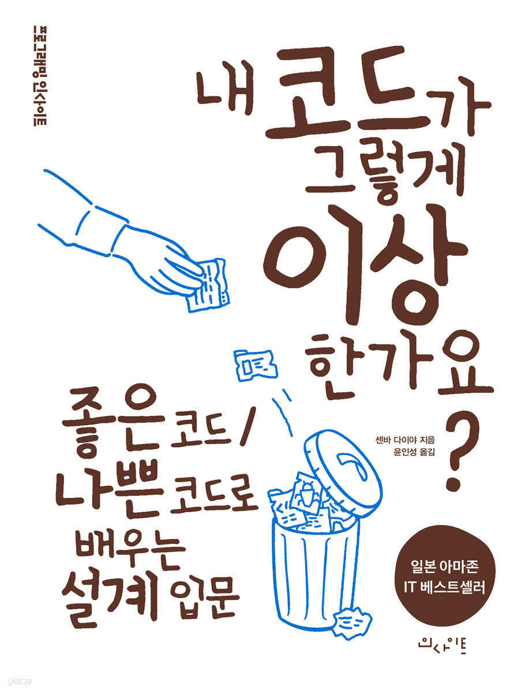

> 좋은 코드/나쁜 코드로 배우는 설계 입문 by 센바 다이야 part 2

# Intro

## 자기소개

이름/연차/직무/사용해본 언어/관심있는 분야

직무에서

- 직장인이면 회사에서 어떤 일을 담당하는지 간략히 이야기해주세요.
- 이 외는 어떤것을 해봤고 또는 어떤 일을 하고 싶은지 이야기해주세요.

마지막으로 스터디 참여하게된 이유

## 스터디 시간

스터디 시간: 22:30 \~ 23:30 (최대 1시간)
스터디 기간: 6/25 \~ 8/27
스터디 범위: 12장~끝까지

- 12 13 14 15 16

## 스터디 방향

- 돌아가면서 발표 담당자가 맡은 `파트에 대해서 정리`해서 갖고 옵니다 (30~40분 분량 목표)
  - 미리 해당 부분에 대해서 읽어와도 좋고 안읽어와도 좋습니다.
  - 인터넷에 나온 자료들 갖고와서 준비해도 괜찮습니다. 틀린 정보만 아니면 괜찮아요.
  - 발표 분량을 너무 길게 혹은 너무 짧게만 준비하지 말아주세요.
  - 사정이 생겨서 발표 준비가 어렵다면 `일요일 밤 23시`까지 연락주세요.
  - 만약에 스터디 시간에 맡은 부분을 다 못 끝냈으면 다음 시간에 이어서 할게요.
- 발표는 깃헙, 노션 등 자유롭게 작성하되 스터디 이전에 미리 공유만 해주시면 됩니다.
  - 공개된 repo 인만큼 문제가될 개인/기밀 정보는 빼주셔야해요.
- 이론적인 부분도 좋지만 예시가 많을 수록 좋습니다
- 이해가 잘 안가는 부분은 언제든지 중간 중간에 물어봐도 좋습니다. 저도 최대한 물어볼꺼에요.
- 제가 스터디 당일에 디코에 멘션하긴 할탠데 저도 깜빡할 수 있으니 잊지말고 디코 들어와주세요.
- 발표자는 `웹켐` 당연히 키겠지만 듣는분들도 `같이 웨켐 켜주셔야하니다`. 마이크는 꺼도되고 켜놔도 됩니다.
- 공지에 따르면 스터디 멤버들의 동의 하에 녹음 혹은 녹화를 진행하실 수 있다고 하는데 저는 따로 녹음/녹화할 예정이 없어서 만약에 하실분은 미리 해당 챕터 시작 전에 말씀해주세요.
- 불편/개선할 부분이 있으면 언제든지 따로 말씀주세요.

발표 담당자가 의견 나눌 수 있는 주제 2-3개 준비해오기

- 예) 함수 인자 많은거에 대해서 어떻게 생각하시나요? 몇개까지 괜찮은지? 3개? 4개?

## 범위

스터디 part 2

- 1주차 Intro + 12장
- 2주차 13장
- 3주차 14장
- 4주차 15장
- 5주차 16장
- 6주차 ?
- 7주차 ?
- 8주차 ?
- 9주차 ?
- 10주차 ?

다른 책 또는 직무 + 직무처리 방식 등의 특강

## 들어가며

> 내용이 엄청 복잡한게 아니여서

'이상적인 구조'를 알면 좋지 않은 구조를 명확하게 인지할 수 있습니다.
이 책에서는 개발 능력을 떨어뜨리고 소프트웨어의 성장을 방해하는 설계/구현상의 문제를 '악마'에 비유합니다.
이 책은 소프트웨어 개발에 숨어 있는 악마를 인식하고 퇴치할 수 있게 도와주는 설계 테크닉을 다룹니다.

### 객체 지향 설계를 다루는 이유

애플리케이션 아키텍트로서 시스템 설계와 관련된 일을 하고 있습니다

- 유지 보수가 어려워진 시스템을 재설계하거나, 새로운 시스템을 만들 때 확장성을 높이기 위한 설계
- 샘플 코드로 나쁜 코드가 아주 많이 등장하는데 실제 사례 기반

나쁜 코드를 좋은 코드로 바꾸는 실첱적인 객체 지향 설게 기법을 설명합니다

책의 코드가 전부 JAVA 로 구성되어 있습니다.
