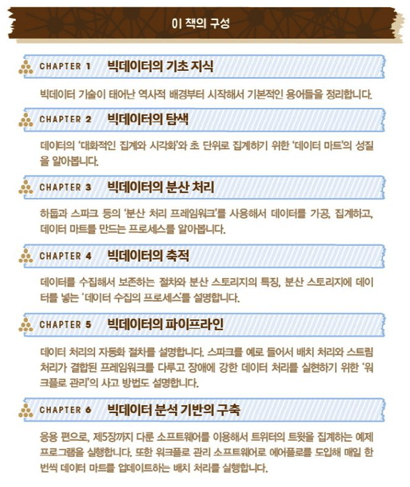

> 빅데이터를 지탱하는 기술
> https://product.kyobobook.co.kr/detail/S000001916916

# Intro

## 자기소개

이름/연차/직무/사용해본 언어/관심있는 분야

직무에서

- 직장인이면 회사에서 어떤 일을 담당하는지 간략히 이야기해주세요.
- 이 외는 어떤것을 해봤고 또는 어떤 일을 하고 싶은지 이야기해주세요.

마지막으로 스터디 참여하게된 이유

## 스터디 시간

스터디 시간: 22:30 \~ 23:30 (최대 1시간)
스터디 기간: 10/1 \~ 1월
스터디 범위: 1장~6장

## 스터디 방향

- 돌아가면서 발표 담당자가 맡은 `파트에 대해서 정리`해서 갖고 옵니다 (30~40분 분량 목표)
  - 미리 해당 부분에 대해서 읽어와도 좋고 안읽어와도 좋습니다.
  - 인터넷에 나온 자료들 갖고와서 준비해도 괜찮습니다. 틀린 정보만 아니면 괜찮아요.
  - 발표 분량을 너무 길게 혹은 너무 짧게만 준비하지 말아주세요.
  - 사정이 생겨서 발표 준비가 어렵다면 `일요일 밤 23시`까지 연락주세요.
    - 대체 스터디로 의견/토론 하면 어떨까 싶네요.
  - 만약에 스터디 시간에 맡은 부분을 다 못 끝냈으면 다음 시간에 이어서 할게요.
- 발표는 깃헙, 노션 등 자유롭게 작성하되 스터디 이전에 미리 공유만 해주시면 됩니다.
  - 공개된 repo 인만큼 문제가될 개인/기밀 정보는 빼주셔야해요.
- 이론적인 부분도 좋지만 예시가 많을 수록 좋습니다
- 이해가 잘 안가는 부분은 언제든지 중간 중간에 물어봐도 좋습니다. 저도 최대한 물어볼꺼에요.
- 제가 스터디 당일에 디코에 멘션하긴 할탠데 저도 깜빡할 수 있으니 잊지말고 디코 들어와주세요.
- 발표자는 `웹켐` 당연히 키겠지만 듣는분들도 `같이 웨켐 켜주셔야하니다`. 마이크는 꺼도되고 켜놔도 됩니다.
- 공지에 따르면 스터디 멤버들의 동의 하에 녹음 혹은 녹화를 진행하실 수 있다고 하는데 저는 따로 녹음/녹화할 예정이 없어서 만약에 하실분은 미리 해당 챕터 시작 전에 말씀해주세요.
- 불편/개선할 부분이 있으면 언제든지 따로 말씀주세요.

발표 담당자가 의견 나눌 수 있는 주제 최소 1개 준비해오기

- 예) 함수 인자 많은거에 대해서 어떻게 생각하시나요? 몇개까지 괜찮은지? 3개? 4개?

## 범위

스터디 part 1

- 1주차 - Intro + 1-1 - 재호님
- 2주차 -
- 3주차 -
- 4주차 -
- 5주차 -
- 6주차 -
- 7주차 -
- 8주차 -
- 9주차 -
- 10주차 -

## 들어가며

> 전반적인 빅데이터 기술에 대해서 간략하게 훑고 가는 책이여서

입문용으로 빅데이터 기술에 대해서 알아가는 책이여서 각 기술별로 깊게 들어가면
공부하고 알아야할 부분이 많아서 살펴보고 좋은 책이라고 봅니다.

이 책은 빅데이터의 기초 지식을 시작으로, 일반적인 빅데이터 기반 시스템의 구성, 빅데이터 검색,
빅데이터 수집, 빅데이터 파이프라인에서의 배치 처리와 스트림 처리, 그리고 자동화 등에 이르기까지
빅데이터 분야의 전체 구성을 단계별, 상황별로 해설한다.

**이 책은 데이터 분석의 기법에 대해서 거의 다루지 않고, 데이터 처리를 어떻게 시스템화하는가에 대한 문제를 다룬다.**

### 이 책에 대하여

하드웨어의 발전이 이루어 지면서 이를 뒷받침 하여 소프트웨어 발전이 이루어 졌고, 이는 시스템이란 이름 하에 기술적 발전이 이루어졌다.
이러한 시스템들이 작동할 때마다 데이터를 만들어 내는데, 이 데이터를 토대로 무슨 일이 일어나고 있는지를 파악할 수 있고
더 나아가, 앞으로 시스템을 어떻게 운영할 지에 대한 전략을 세울 수 있게 된다.

실제로 눈에 보이는 것과 달리, 이렇게 데이터를 통해 무언가를 하기 위해서는 데이터 자체에 대한 가공이 이루어 져야 한다.
즉 데이터를 어떻게 활용할 지가 아닌, 데이터 자체를 어떻게 전달하고 처리하고 보관할 지에 대한 엔지니어 적인 고민이 중요한 것이다.
이 책은 이러한 엔지니어 적인 부분에 대한 기술적인 고민을 다루었다.

가령 커머스에서 물건을 구매할 때, 배후에서는 결제, 재고관리, 배송 등 다양한 시스템이 연결되어 작동한다.
이러한 시스템들은 데이터를 생성하고, 이러한 데이터를 토대로 현 상황을 파악하고 다음의 지시가 담긴 사이클을 자동화하고,
이 프로세스를 다시 시스템에 통합해서 새로운 작업의 효율화를 꾀할 수 있다.

앞으로 데이터를 활용해 업무를 개선하거나 데이터처리 그 자체를 시스템 일부로 하는 일이 증가할 것이다.
다수의 장치에서 데이터를 수집하기 위한 구조는 빅데이터 기술의 근간이 되어, 실시간 메시지전달, 중복제거
그리고 분산스토리지 등이 중요한 개념으로 작용된다.

데이터 분석에서 80%의 시간이 데이터를 준비하는 데 소요된다고 한다.

- "데이터 과학자로 입사했더니 데이터의 전처리만 주로 하고 있다"는 하소연이 많다
- 데이터 준비라는 엔지니어링 부분을 효율화하지 않으면 데이터 분석의 수고가 사라지는 일은 없다.

### 책의 구성

