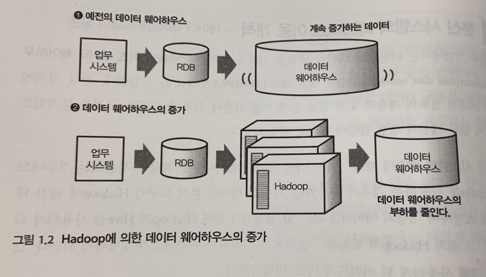
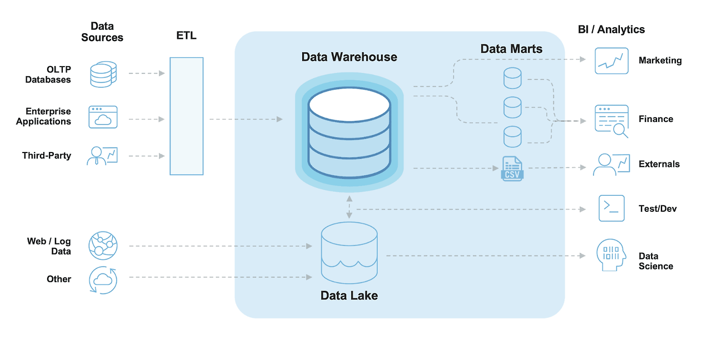
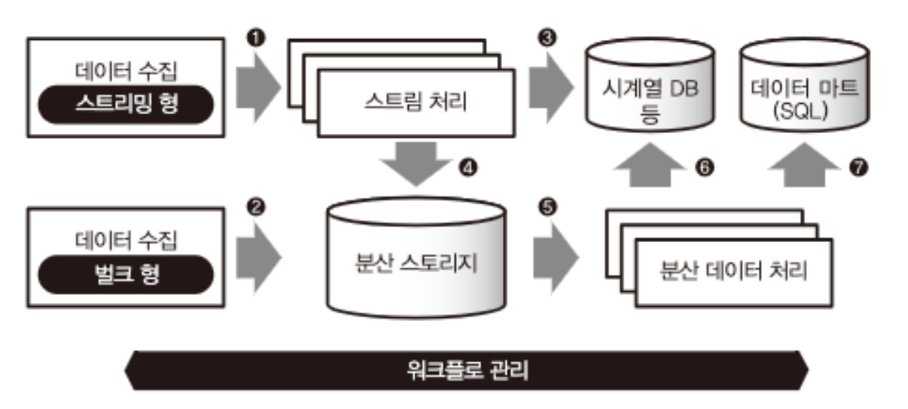
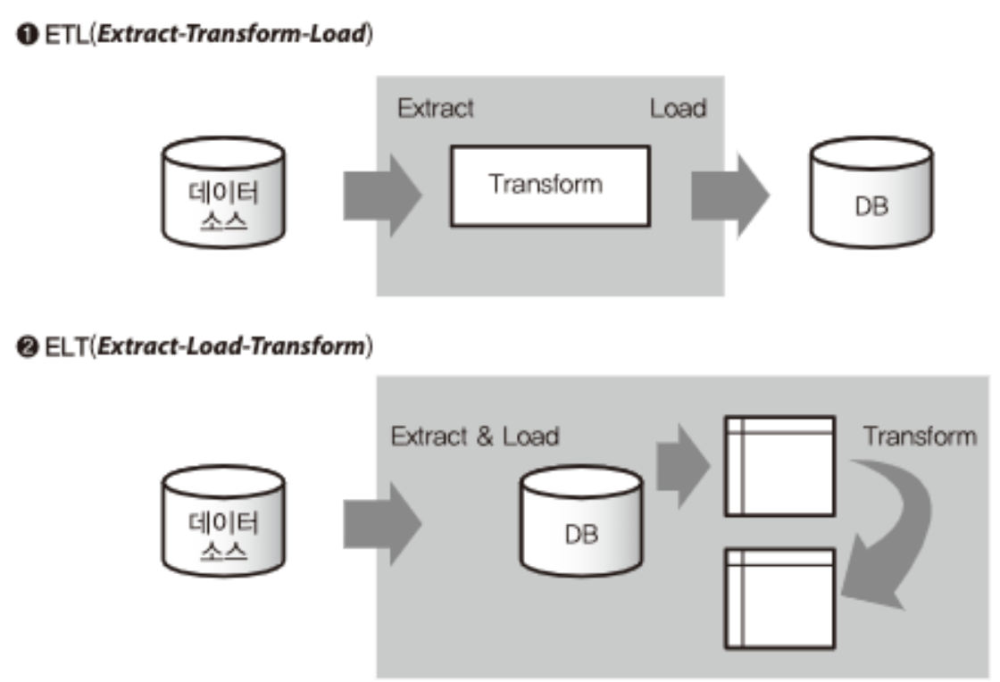
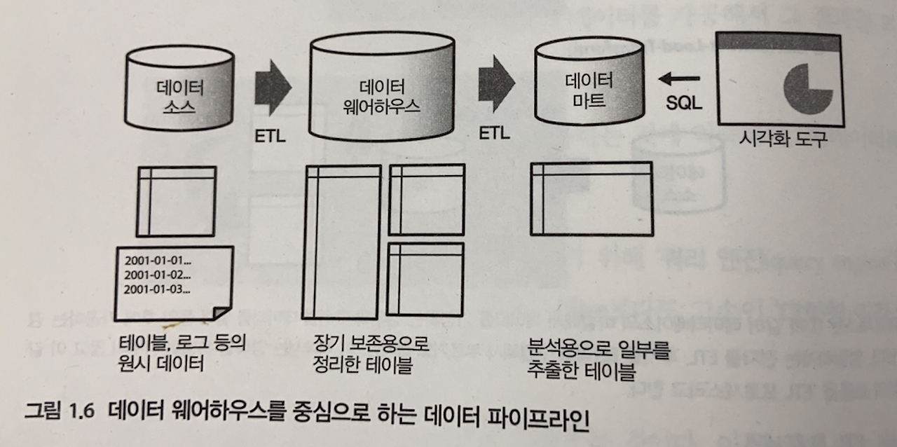
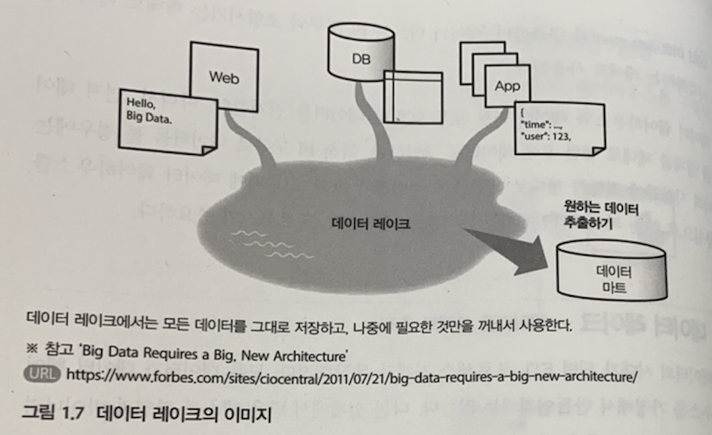
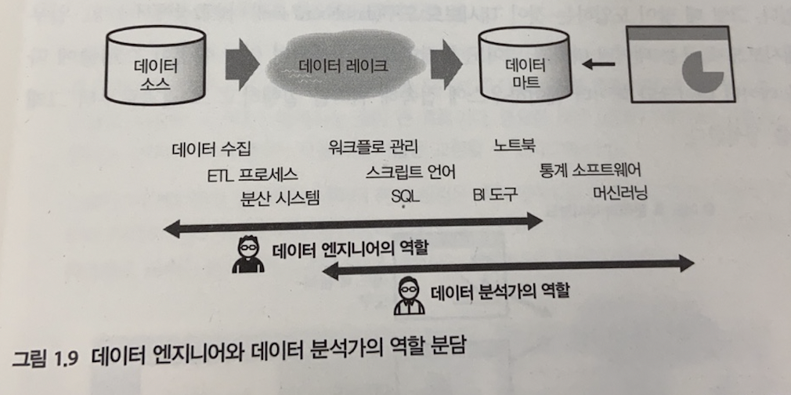

# 1. 빅데이터의 기초 지식

> 데이터 플로우에는 여러 단계가 있는데 관련하여 의미 있었던 경험 공유하기 - 데이터 수집 (벌크, 스트리밍형), 데이터 처리(배치, 실시간), 데이터 저장 (데이터 마트 구성/최적화), 데이터 분석 및 시각화 경험 (BI tool)

> 데이터 과학자 / 엔지니어 / 분석가, 각 직군의 [역할](https://socrates-dissatisfied.tistory.com/entry/%EB%8D%B0%EC%9D%B4%ED%84%B0%EB%B6%84%EC%84%9D%EA%B0%80-vs-%EB%8D%B0%EC%9D%B4%ED%84%B0%EC%97%94%EC%A7%80%EB%8B%88%EC%96%B4-vs-%EB%8D%B0%EC%9D%B4%ED%84%B0%EA%B3%BC%ED%95%99%EC%9E%90%EC%82%AC%EC%9D%B4%EC%96%B8%ED%8B%B0%EC%8A%A4%ED%8A%B8-%EC%B0%A8%EC%9D%B4%EB%8A%94?category=980488)은 ?

## 1.1 (배경) 빅데이터의 정착

- ~2011년 : 하둡이나 NoSQL 데이터 베이스 등 기반 기술의 발전
- ~2012년 : 클라우드 방식의 데이터 웨어하우스나 BI 도구의 보급 (BI, Business Intelligence : 이전부터 데이터 웨어하우스와 조합되어 사용되던 경영자용 시각화 시스템)
- 2013년~ : 스트림처리, 애드 혹(adhoc) 분석 환경의 확충

> 정확히 언제인지는 모르지만 2012년 이후에 MySQL Sharding 기술이 유행하기 시작 (분산 스토리지의 초창기 버전)

- Sharding (샤딩) : 영어 의미로 조각을 의미한다. 즉 샤딩은, 어떤 큰 한가지를 나눈 것을 의미한다고 할 수 있다.
- https://dev.gmarket.com/61

### 분산시스템에 의한 데이터 처리의 고속화 - 빅데이터의 취급하기 어려운 점을 극복한 두 가지 대표 기술

'빅데이터(big data)'라는 단어를 대중 매체를 통해 자주 접하게 된 것은 2011년 후반에서 2012년에 걸쳐
많은 기업들이 데이터 처리에 분산 시스템을 도입하기 시작 했을 무렵일 것이다.

데이터 처리 분산 시스템을 도입하면서 말그대로 Big데이터 즉, 많은 양의 데이터를 처리 가능하게 하면서 빅데이터라는 용어가 화두에 오를 수 있게 되었다.
그러나 현재까지도 '빅데이터의 기술이 큰 어려움 없이 안심하고 사용할 수 있다'고 말하기는 어려운 상황이며,
실제로 '데이터를 모아서 무엇을 할 것인가?'에 대해서도 명확하게 해답을 내리기 어려운 상황이다.

빅데이터의 취급이 어려운 이유

1. 데이터의 분석 방법을 모른다 -> 데이터가 있어도 그 가치를 창조하지 못하면 의미가 없다
2. 데이터 처리에 수고와 시간이 걸린다 -> 지식이 있어도 시간을 많이 소비하면 할 수 있는 것이 한정 된다

#### 빅데이터 기술의 요구 - Hadoop과 NoSQL의 대두

가장 처음으로 NoSql, Hadoop 등장.
즉 기존의 정형화된 데이터 뿐 아니라 비정형화된 데이터를 **대량**으로 다룰 수 있는 시스템이 필요했고, 이러한 처리 엔진 시스템인 Hadoop이 등장한 것.

#### Hadoop - 다수의 컴퓨터에서 대량의 데이터 처리

Hadoop(이하 하둡)은 다수의 컴퓨터에서 대량의 데이터를 처리하기 위한 시스템이다.
대량의 데이터를 처리하기 위해 이를 저장해 둘 스토리지와 데이터를 순차적으로 처리할 수 있는 구조가 필요하다.
이를 위해서는 수 백, 수 천대의 컴퓨터가 이용되어야 하며, 하둡은 이를 관리하기 위한 프레임 워크이다.

초기에는 하둡에서 분산 처리 프레임 워크인 MapReduce를 동작시키려면 해당 내용을 자바 언어로 프로그래밍 해야 했다.
그래서 활용도가 좋지 못했다. 그래서 SQL과 같은 쿼리 언얼르 하둡에서 실행하기 위한 소프트웨어로 Hive가 개발되어 출시 되었다.
이에 대한 도입으로 별도의 프로그래밍없이 데이터를 집계할 수 있게 되었다.

- [2004년 12월, MapReduce Google 논문 발표](https://static.googleusercontent.com/media/research.google.com/ko//archive/mapreduce-osdi04.pdf)
- 자세한건 5장에서 설명 (분산 처리)

#### NoSQL DB - 빈번한 읽기/쓰기 및 분산처리에 강점

전통적인 RDB의 제약을 제거하는 것을 목표로 사용되기 시작했다.
NoSQL은 전통적인 RDB의 제약을 제거하는 것을 목표로 한 데이터베이스의 총칭이다. NoSQL 데이터베이스에는 다양한 종류가 있다.

- 다수의 키와 값을 관련지어 저장하는 '키 밸류 스토어(key-value store/KVS)'
- JSON과 같은 복잡한 데이터 구조를 저장하는 '도큐멘트 스토어(document store)'
- 여러 키를 사용하여 높은 확장성을 제공하는 '와이드 칼럼 스토어(wide-column store)'

#### Hadoop과 NoSQL의 데이터베이스의 조합 - 현실적인 비용으로 대규모 데이터 처리 실현

NoSQL과 합쳐져서 NoSQL로 데이터를 기록하고 하둡으로 분산처리 하는 시스템에 2011년 후반 즈음에 정착하게 된다.

-> 하둡은 저장 후 집계를 분산처리하기 위함. NoSQL은 온라인으로 접근 시 분산작업을 하기 위함

### 분산 시스템의 비즈니스 이용 개척 - 데이터 웨어하우스와의 공존

일부 기업에서는 이전부터 데이터 분석을 기반으로 하는 '엔터프라이즈 데이터 웨어하우스(enterpirse data warehouse/EDW, 또는 데이터 웨어하우스/DWH)'를 도입했다.
전국 각지에서 보내진 점포의 매출과 고객 정보 등이 오랜 기간에 걸쳐 축적되고, 그것을 분석함으로써 업무 개선과 경영 판단의 자료로 활용되었다.

기존에 대량의 데이터를 이미 DWH(data warehouse) - 엔터프라이즈 데이터 웨어하우스 에서 처리하고 있었으나, 확장성등을 고려하면 하드웨어까지 교체해야하는 DWH보다는 하둡이 빅데이터 처리에는 더 용이했다.
따라서 대량의 데이터 처리를 **하둡에서 전처리 및 저장**하고, 정말 중요한 데이터만을 **DWH에 저장**하여 분석에 활용하는 식으로 하둡은 DWH의 부하를 줄여주었다.

> 여기서 [data lake, data warehouse, data mart](https://mujilog.tistory.com/entry/%EB%8D%B0%EC%9D%B4%ED%84%B0-%EC%9B%A8%EC%96%B4%ED%95%98%EC%9A%B0%EC%8A%A4%EB%8D%B0%EC%9D%B4%ED%84%B0-%EB%A7%88%ED%8A%B8%EB%8D%B0%EC%9D%B4%ED%84%B0-%EB%A0%88%EC%9D%B4%ED%81%AC-%EB%9E%80)가 뭘까? [data lakehouse](https://www.databricks.com/blog/2020/01/30/what-is-a-data-lakehouse.html)는?
> 팀 소개 https://naver-career.gitbook.io/kr/service/search/ai-and-data-platform

### 직접할 수 있는 데이터 분석 폭 확대 - 클라우드 서비스와 데이터 디스커버리로 가속하는 빅데이터 활용

이와 비슷한 시기부터 클라우드 서비스의 보급에 의해 빅데이터 활용이 증가하였다. '여러 컴퓨터에 분산 처리한다'라는 점이 빅데이터의 특징이다. 하지만 이를 위한 하드웨어를 준비하고 관리하는 일은 간단하지 않다. 클라우드 시대인 요즘은 시간 단위로 필요한 자원을 확보할 수 있어서 방법만 알면 언제든지 이용할 수 있는 환경이 마련되었다.

### 데이터 디스커버러의 기초지식

비슷한 시기 데이터 디스커버리(BI 도구) 등장

- 데이터 디스커버리 : 데이터 웨어하우스에 저장된 데이터를 대화형으로 시각화하여 가치있는 정보를 찾고자 하는 프로세스
- BI(Business Intelligence) : 이전부터 데이터 웨어하우스와 조합되어 사용되던 경영자용 시각화 시스템

예) [Tableau](https://www.google.com/search?sca_esv=2f8623b159e229b7&sca_upv=1&sxsrf=ADLYWIJEHsgFJQS5IR0bjAfpVu-9soPJmA:1727786362468&q=tableau&udm=2&fbs=AEQNm0DmKhoYsBCHazhZSCWuALW8l8eUs1i3TeMYPF4tXSfZ98Z_XVxzNb13fp2atSe3aTZxh00P4RN46vKaeCU6lCwgokKSAjPDH2MlsSy-8gaDDayZBZR0mV6aRV4B_2V6EUzW6gmWDagbA9i_tdBhXCR5aO_Ctj9HTD4Rxjhe9wb1B4pEAtJmiFjM7aw8a7IxIp8er36am9FOpaHD0eVWxKOoI68lIw&sa=X&ved=2ahUKEwiFv4fjme2IAxUVZfUHHSUYGRAQtKgLegQIHBAB&biw=1733&bih=1126&dpr=0.95)

## 1.2 빅데이터 시대의 데이터 분석 기반

빅데이터 기술이 기존의 데이터 웨어하우스와 다른 점은 다수의 분산 시스템을 조합하여 확장성이 뛰어난 데이터 처리 구조를 만든다는 점이다.
이번 장에서는 그 차이에 관해 설명하고자 한다.

### 빅데이터의 기술 - 분산 시스템을 활용해서 데이터를 가공해 나가는 구조

이 책에서 다루는 '빅데이터 기술'이란 분산 시스템을 활용하면서 데이터를 순차적으로 가공해 나가는 일련의 구조다.
이것을 실제로는 아래의 그림과 같이 여러 서브 시스템을 조합함으로써 실현 가능하다.

데이터 파이프라인 - 데이터 수집부터 워크플로 관리까지

- 데이터 파이프라인 : 데이터가 흘러가는 시스템
- 파이프라인에 하고싶은 일이 증가됨에 따라 시스템은 점차 복잡해지고, 그것을 어떻게 조합시킬지가 문제가 됨

데이터 수집 - 벌크 형과 스트리밍 형의 데이터 전송

- 데이터 파이프라인은 데이터를 모으는 부분부터 시작됨
- 데이터는 여러 장소에서 발생하고 각기 다른 형태를 보일 수 있음
- 데이터 전송(data transfer)의 방법은 크게 두 가지가 있음

'데이터 전송(data transfer)'의 방법은 크게 다음의 두 가지가 있다.

- 벌크(bulk)형 - 그림 1.4 2️⃣
  - 어딘가에 존재하는 데이터를 정리해 추출하는 방법
  - 데이터베이스와 파일 서버 등에서 정기적으로 데이터를 수집하는 데 사용됨
- 스트리밍(streaming)형 - 그림 1.4 1️⃣
  - 차례차례로 생성되는 데이터를 끊임없이 계속해서 보내는 방법.
  - 모바일 앱, 임베디드 기계 등에서 발생하는 데이터를 수집하는 데 사용됨

#### 스트림 처리와 배치 처리

기존에는 데이터 웨어하우스에서 다루는 데이터를 전송하기 위해 **벌크**형 배치 처리 방법을 주로 이용했다.
그러나 실시간 데이터 처리를 해야할 필요성이 대두되면서 (모바일 어플리케이션 등) '스트림 처리(stream processing)'를 주류로 사용하기 시작했다.

- 과거 30분간 취합한 데이터를 집계하여 그래프를 만들려면, '시계열 데이터 베이스(time-series database)'와 같은 실시간 처리를 지향한 데이터베이스가 자주 사용된다(그림 1.4 3️⃣).
- 스트림 처리의 결과를 시계열 데이터베이스에 저장함으로써, 지금 무슨 일이 일어나고 있는지 즉시 알 수 있다.

그러나 장기적인 데이터 분석을 위해서는 스트림 처리 또한 적합하지 않다.
장기적인 데이터 분석을 위해서는 보다 대량의 데이터를 저장하고 처리하는 데 적합한 분산 시스템이 좋다(그림 1.4 4️⃣ 5️⃣).
거기에 필요한 것은 스트림 처리가 아닌, 어느 정도 정리된 데이터를 효율적으로 가공하기 위한 '배치 처리(batch processing)'구조다.

#### 분산 스토리지 (객체 스토리지, NoSQL 데이터베이스)

수집된 데이터는 분산 스토리지(distribute storage)에 저장 (그림 1.4 2️⃣ 4️⃣)

- 분산 스토리지 : 여러 컴퓨터와 디스크로부터 구성된 스토리지 시스템
- 객체 스토리지 : 한덩어리로 모인 데이터에 이름을 부여해서 파일로 저장하며 대표적으로 S3

#### 분산 데이터 처리 (쿼리 엔진, ETL 프로세스)

- 분산 데이터 처리의 주 역할은 나중에 분석하기 쉽도록 데이터를 가공해서 그 결과를 외부 데이터베이스에 저장하는 것임
- 분산 스토리지에 저장된 데이터를 처리하는 데는 분산 데이터 처리 프레임워크가 필요함 (그림 1.4 6️⃣ 7️⃣).
  - MapReduce 등

대다수의 사람들은 데이터 집계에 있어서 **SQL**을 사용하는 것에 익숙하다. 빅데이터를 SQL로 집계할 때는 두 가지 방법이 있다.

1. 쿼리 엔진(query engine) 도입 : ex) [Hive](https://hive.apache.org/), [Trino](https://trino.io/), 대화형 쿼리 엔진(interactive query engine) …
2. 외부의 데이터 웨어하우스 제품을 이용하는 것 : ex) AWS Redshift, Google BigQuery, …
   - 이를 위해서는 분산 스토리지에서 추출한 데이터를 데이터 웨어하우스에 적합한 형식으로 변환해야 함.
   - 이러한 절차를 ETL(Extract - Transform - Load)(or ELT) 프로세스라고 함.

#### 워크플로 관리

전체 데이터 파이프라인의 동작을 관리하기 위해서 워크플로 관리 기술을 사용함

- ex) 매일 정해진 시간에 배치 처리를 실행
- ex) 특정한 순서대로 파이프라인을 동작
- ex) 오류가 발생한 경우, 관리자에게 통지

### 데이터 웨어하우스와 데이터 마트 - 데이터 파이프라인 기본형

- 데이터 웨어하우스(data warehouse) : 웹 서버 등에 사용하는 일반적인 RDB와는 달리 ‘대량의 데이터를 장기 보존하는 것’에 최적화되어 있음. 따라서 정리된 대량의 데이터를 한 번에 전송하는 것은 뛰어나지만, 소량의 데이터를 자주 쓰고 읽는 데는 적합하지 않음.
- 데이터 마트(data mart) : 데이터 분석과 같은 목적에 사용하는 경우에는 데이터 웨어하우스에서 필요한 데이터만을 추출하여 ‘데이터 마트’를 구축함. (웨어하우스와 마찬가지로 SQL 형태)
- ETL 프로세스 : 보존된 '로우 데이터(raw data, 원시 데이터)'를 추출하고 필요에 따라 가공한 후 데이터 웨어하우스에 저장하기까지의 흐름

### 데이터 레이크 - 데이터를 그대로 축적

모든 데이터가 데이터 웨어하우스를 가정해서 만들어지지는 않는다.
다른 업체에서 받은 텍스트 파일과 바이너리 데이터(binary data) 등은 있는 그대로 데이터 웨어하우스에 넣을 수 없는 것도 있다.
우선 데이터가 있고, 나중에 테이블을 설계하는 것이 빅데이터다.

모든 데이터를 원래의 형태로 축적해두고 나중에 그것을 필요에 따라 가공하는 구조가 필요하다.
빅데이터의 세계에서는 여러 곳에서 데이터가 흘러들어 오는 '데이터를 축적하는 호수'에 비유해 데이터의 축적 장소를 '데이터 레이크(data lake)'라고 한다

### 데이터 분석 기반을 단계적으로 발전시키기

... To Be Continue...

## 참고

- 빅데이터를 지탱하는 기술 https://product.kyobobook.co.kr/detail/S000001916916
- https://dianakang.tistory.com/38
- https://hazel-developer.tistory.com/210
- https://dianakang.tistory.com/39
