> 분산 시스템의 대표적인 프레임워크인 Hadoop과 Spark를 이요한 데이터 처리에 관한 설명

# 3장 - 빅데이터의 분산 처리

## 3-1. 대규모 분산 처리의 프레임 워크

### 구조화 데이터와 비구조화 데이터

> SQL로 데이터를 집계하는 경우, 테이블의 칼럼 명과 데이터형, 테이블 간의 관계 등을 스키마(schema)로 정함

'구조화 데이터(structed data)' : 스키마가 명확하게 정의된 데이터
'비구조화 데이터(unstructed data)' : 스키마가 없는 데이터는 (자연 언어로 작성된 텍스트, 이미지, 동영상 등의 미디어 데이터)


**비구조화 데이터**를 분산 스토리지 등에 저장하고 그것을 분산 시스템에서 처리하는 것이 **데이터 레이크**의 개념이다.

- lake는 호수이여서 모든 것을 다 담을 수 있다는 의미

데이터를 가공하는 과정에서 스키마를 정의하고, 구조화된 데이터로 변환함으로써 다른 데이터와 마찬가지로 분석할 수 있다.

#### 스키마리스 데이터 - 기본 서식은 있지만 스키마가 정의 안 됨

CSV, JSON, XML 등의 데이터는 서식은 정해져 있지만, 컬럼 수나 데이터형은 명확하지 않아 '스키마리스 데이터(schemaless data)'라고 불린다.
데이터 레이크에서는 대량으로 축적된 스키마리스 데이터를 효율적으로 처리하도록 하는 요구도 종종 있다.

#### 데이터 구조화의 파이프라인 - 테이블 형식으로 열 지향 스토리지에 장기 보존

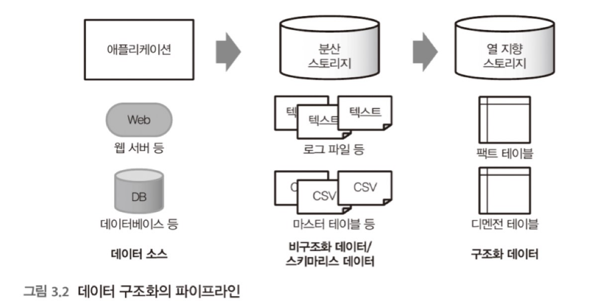

- 각 데이터 소스에서 수집된 비구조화 데이터, 스키마리스 데이터는 처음에 분산 스토리지에 보존
- 여기에는 웹 서버의 로그 파일과 업무용 데이터베이스에서 추출한 마스터 데이터 등이 포함
- 분산 스토리지에 수집된 데이터는 명확한 스키마를 갖지 않는 것도 많아 그냥 그대로 SQL로 집계할 수 없음
- 따라서, 먼저 필요한 것은 스키마를 명확하게 한 테이블 형식의 '구조화 데이터'로 변환
- 일반적으로 구조화 데이터는 압축률을 높이기 위해 '열 지향 스토리지'로 저장한다.
- MPP 데이터베이스로 전송하거나 Hadoop 상에서 열 지향 스토리지 형식으로 변환한다.
  - 구조화 데이터 중 시간에 따라 증가하는 데이터를 팩트 테이블
  - 그에 따른 부속 데이터를 디멘전 테이블로 취급

#### 열 지향 스토리지의 작성 - 분산 스토리지 상에 작성해 효율적으로 데이터를 집계

MPP 데이터베이스의 경우, 제품에 따라 스토리지의 형식이 고정되어 있어 사용자가 그 상세를 몰라도 괜찮다.
하지만 Hadoop에서는 사용자가 직접 열 지향 스토리지의 형식을 선택하고, 자신이 좋아하는 쿼리 엔진에서 집계할 수 있다.

Hadoop에서 사용할 수 있는 열 지향 스토리지에 몇 가지 종류가 있다.

1. [Apache ORC](https://orc.apache.org/) : 처음에 스키마를 정한 후 데이터를 저장한다. (이 책에서 사용하는 열 지향 스토리지 방식)
2. [Apache Parquet](https://parquet.apache.org/) : 스키마리스에 가까운 데이터 구조로 되어 있어 JSON 같은 뒤얽힌 데이터도 그대로 저장할 수 있다.

비구조화 데이터를 읽어 들여 열 지향 스토리지로 변환하는 과정에서는 데이터의 가공 및 압축을 위해 많은 컴퓨터의 리소스가 소비된다.

그래서 사용되는 것이 Hadoop과 Spark 등의 분산 처리 프레임워크다.

### Hadoop - 분산 데이터 처리의 공통 플랫폼

Hadoop은 단일 소프트웨어가 아니라 분산 시스템을 구성하는 다수의 소프트웨어로 이루어진 집합체이다.

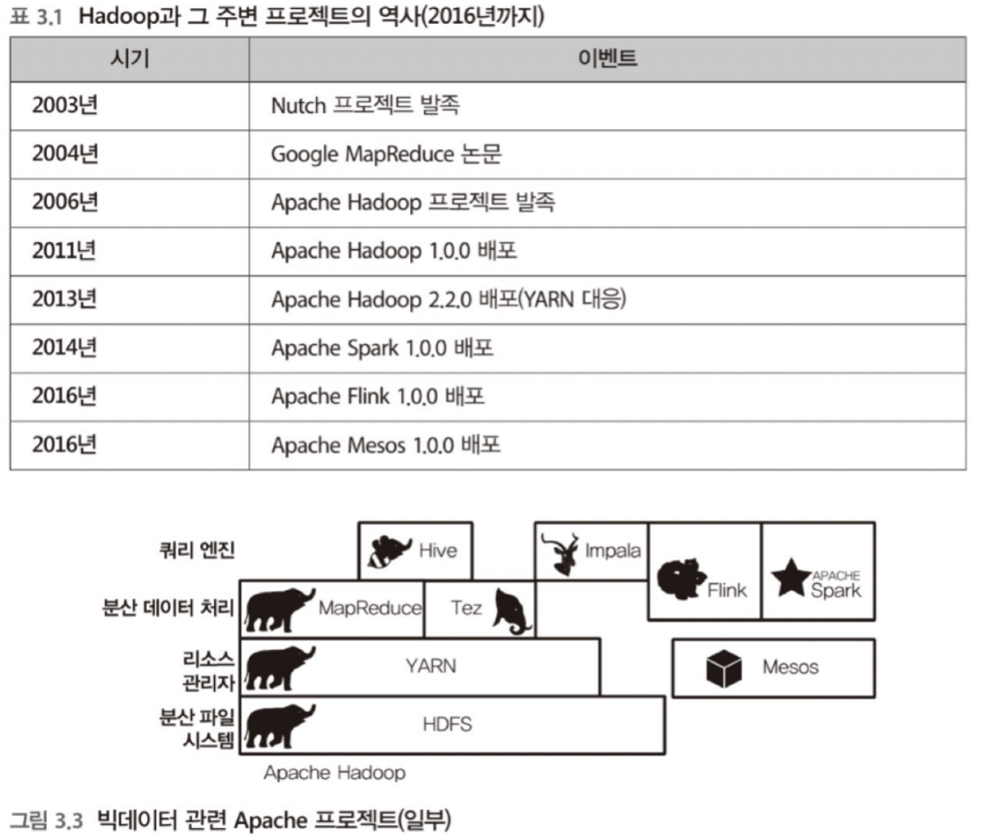

#### 분산 시스템의 구성 요소 - HDFS, YARN, MapReduce

Hadoop의 기본 구성 요소

1. 분산 파일 시스템 : HDFS (Hadoop Distributed File System)
2. 리소스 관리자 : YARN (Yet Another Resource Negotiator)
3. 분산 데이터 처리 : MapReduce

그 외의 프로젝트는 Hadoop 본체와는 **독립적으로 개발**되어 Hadoop을 이용한 분산 어플리케이션으로 동작한다.

모든 분산 시스템이 Hadoop에 의존하는 것이 아니라, Hadoop을 일부만 사용하거나, 혹은 전혀 이용하지 않는 구성도 있음

- 예) HDFS(파일 시스템) + Mesos(리소스 관리자) + Spark(분산 데이터 처리)

다양한 소프트웨어 중에서 자신에게 맞는 것을 선택하고 그것들을 조합함으로써 시스템을 구성하는 것이 Hadoop을 중심으로 하는 데이터 처리의 특징

#### 분산 파일 시스템과 리소스 관리자 - HDFS, YARN

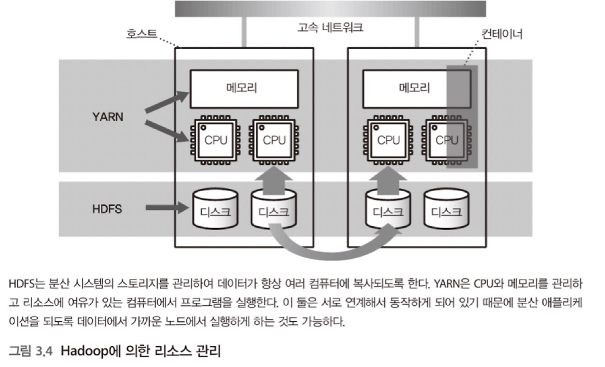

- 하둡에서 처리되는 데이터 대부분은 분산 파일 세스템인 HDFS에 저장
- 네트워크에 연결된 파일 서버와 같은 존재이지만, 다수의 컴퓨터에 파일을 복사하여 중복성을 높인다는 특성이 있음
- CPU나 메모리 등의 계산 리소스는 리소스 매니저인 YARN에 의해 관리됨
- YARN은 애플리케이션이 사용하는 CPU 코어와 메모리를 컨테이너(container)라 불리는 단위로 관리함
  - YARN 컨테이너 : OS 수준의 가상화 기술이 아니라 어떤 호스트에서 어떤 프로세스를 실행시킬 것인지 결정하는 어플리케이션 수준의 기술 (도커 x)
- Hadoop에서 분산 애플리케이션을 실행하면 YARN이 클러스터 전체의 부하를 보고 비어 있는 호스트부터 컨테이너를 할당
- 분산 시스템은 많은 계산 리소스를 소비하지만, 호스트의 수에 따라 사용할 수 있는 리소스의 상한이 결정
- 한정된 리소스로 다수의 분산 어플리케이션이 동시에 실행되므로 애플리케이션 간에 리소스 쟁탈이 발생

#### 분산 데이터 처리 및 쿼리 엔진 - MapReduce, Hive

- MapReduce는 YARN 상에서 동작하는 분산 애플리케이션 중 하나이며, 분산 시스템에서 데이터 처리를 실행하는 데 사용됨
- MapReduce는 임의의 자바 프로그램을 실행시킬 수 있기 때문에 비구조화 데이터를 가공하는 데 적합
- 대량의 데이터를 배치 처리하기 위해 개발된 시스템으로, 작은 프로그램을 실행하려면 오버헤드가 너무 큼
- SQL 등의 쿼리 언어에 의한 데이터 집계가 목적이라면 그것을 위해 설계된 쿼리 엔진을 사용함
- 그 성질을 계승한 Hive도 마찬가지로 시간이 걸리는 **배치 처리에는 적합**하나, 애드 혹 쿼리를 여러 번 실행하는 데는 부적합하다.


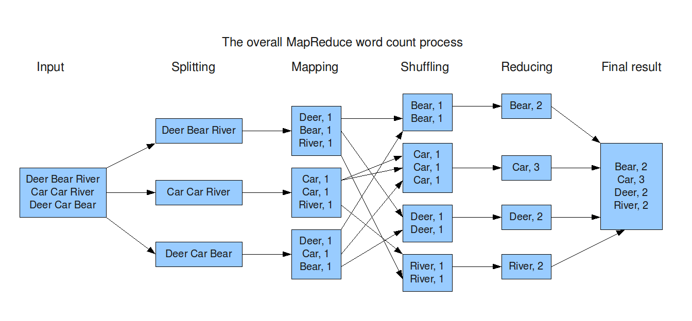

#### Hive on Tez

Apache Tez: Hive를 가속화하기 위한 노력으로 개발됨

현재의 Hive는 MapReduce뿐만 아니라 Tez를 사용해도 동작하게 재작성되어 있어 'Hive on Tez'라고 불린다.
이에 대해 예전 Hive는 'Hive on MR'이라고 구별된다.

#### 대화형 쿼리 엔진 - Impala와 Presto/Trino

Trino: The Definitive Guide 추천 - https://www.oreilly.com/library/view/trino-the-definitive/9781098137229/

처음부터 대화형 쿼리 실행만 전문으로 하는 쿼리 엔진도 개발되고 있다.
그중 'Apache Impala'와 'Presto'가 대표적이다.

- 대화형 쿼리 엔진으로는 순간 최대 속도를 높이기 위해 모든 오버헤드가 제거되어 사용할 수 있는 리소스를 최대한 활용하여 쿼리를 실행
- 그 결과, 대화형 쿼리 엔진은 MPP 데이터베이스와 비교해도 손색없는 응답시간을 실현

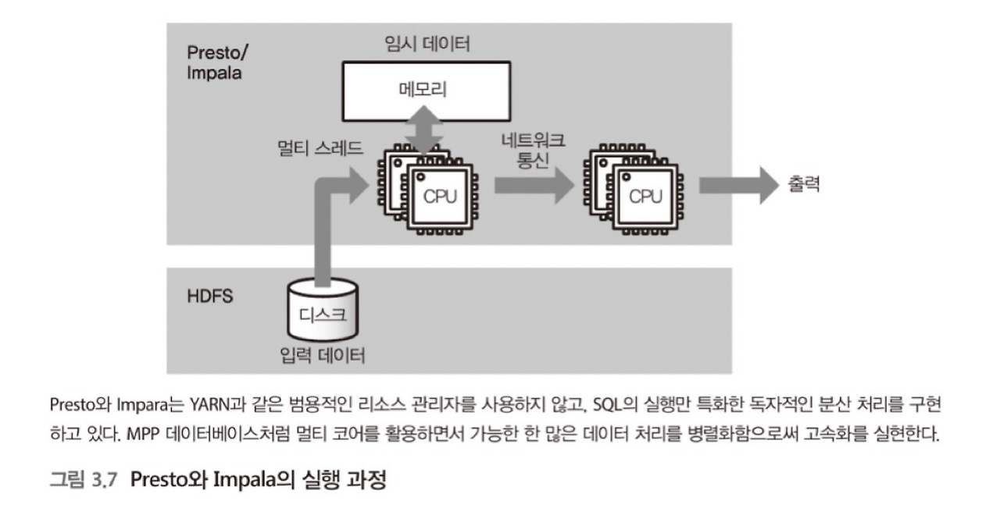

#### Spark - 인 메모리 형의 고속 데이터 처리

Spark: The Definitive Guide 추천 - https://www.oreilly.com/library/view/spark-the-definitive/9781491912201/

- Apache Spark 또한 MapReduce보다 더 효율적인 데이터 처리를 실현하는 프로젝트로 개발
- Hadoop의 연장선 상에 있는 Tez와는 달리, Spark는 Hadoop과는 다른 독립된 프로젝트
- Spark의 특징은 대량의 메모리를 활용하여 고속화를 실현
- MapReduce가 개발된 시절에는 처리해야 할 데이터의 양에 비하면 훨씬 적은 메모리밖에 사용할 수 없음
- 그래서 MapReduce는 그 처리의 대부분을 디스크의 읽고 쓰기에 사용
- 이것은 Tez도 마찬가지로, 데이터 처리의 과정에서 만들어진 중간 데이터는 기본적으로 디스크로 기록
- 컴퓨터에 취급하는 메모리의 양이 증가함에 따라, 뭐든지 디스크에서 읽고 쓰는 것이 아니라 '가능한 한 많은 데이터를 메모리상에 올린 상태로 두어 디스크에는 아무것도 기록하지 않는다'는 선택이 현실화
- 이 경우 컴퓨터가 비정상 종료하면 중간까지 처리한 데이터는 사라져 버리지만 그때에는 처리를 다시 시도해서 잃어버린 중간 데이터를 다시 만들면 된다는 것이 Spark의 개념

#### MapReduce 대체하기 - Spark의 입지

- Spark는 Hadoop이 아니라 MapReduce를 대체하는 존재
- HDFS, YARN은 모두 Spark에서 사용 가능함
- Hadoop을 이용하지 않는 구성 이용 가능
  - 분산 스토리지로 Amazon S3 이용, 분산 DB인 Cassandra에서 데이터 읽어들이기
- Spark 실행에는 자바 런타임이 필요하지만, Spark 상에서 실행되는 데이터 처리는 스크립트 언어로 사용할 수 있음

## 3-2 쿼리 엔진

[Hive](https://hive.apache.org/)에 의한 구조화 데이터의 생성과 Presto에 의한 대화식 쿼리

### 데이터 마트 구축의 파이프라인

쿼리 엔진을 사용하여 데이터 마트를 만들기까지의 흐름(Hive와 Presto 결합)

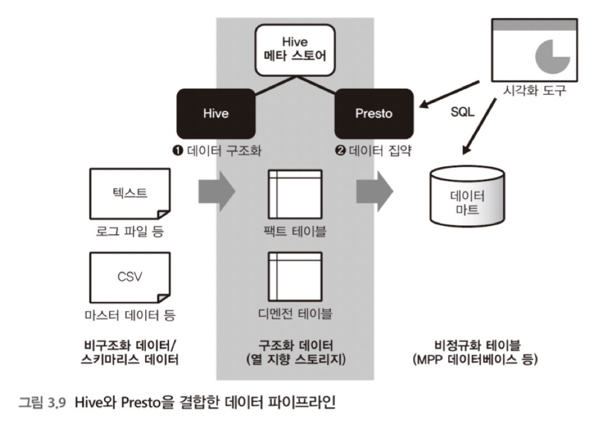

- 우선 처음에 분산 스토리지에 저장된 데이터를 구조화하고 열 지향 스토리지 형식으로 저장한다. (1)
- 이것은 다수의 텍스트 파일을 읽어 들여 가공하는 부하가 큰 처리가 되기 때문이 Hive를 이용한다.
- 완성한 구조와 데이터를 결합, 집계하고 비정규화 테이블로 데이터 마트에 써서 내보낸다. (2)
- 열 지향 스토리지를 이용한 쿼리의 실행에는 Presto를 사용함으로써 실행 시간을 단축할 수 있다.
- Hive에서 만든 각 테이블의 정보는 'Hive 메타 스토어'라고 불리는 특별한 데이터베이스에 저장된다.
- 이것은 Hive뿐만 아니라 다른 SQL-on-Hadoop의 쿼리 엔진에서도 공통의 테이블 정보로 참고된다.

### Hive에 의한 구조화 데이터 작성

Beeline : JDBC client that is based on the SQLLine CLI

- https://github.com/apache/hive/tree/master
- https://cwiki.apache.org/confluence/display/Hive/GettingStarted

우선 Hive를 사용하여 구조화 데이터를 작성한다.
터미널에서 Hive를 시작하고 CREATE EXTERNAL TABLE로 '외부 테이블'을 정의한다.

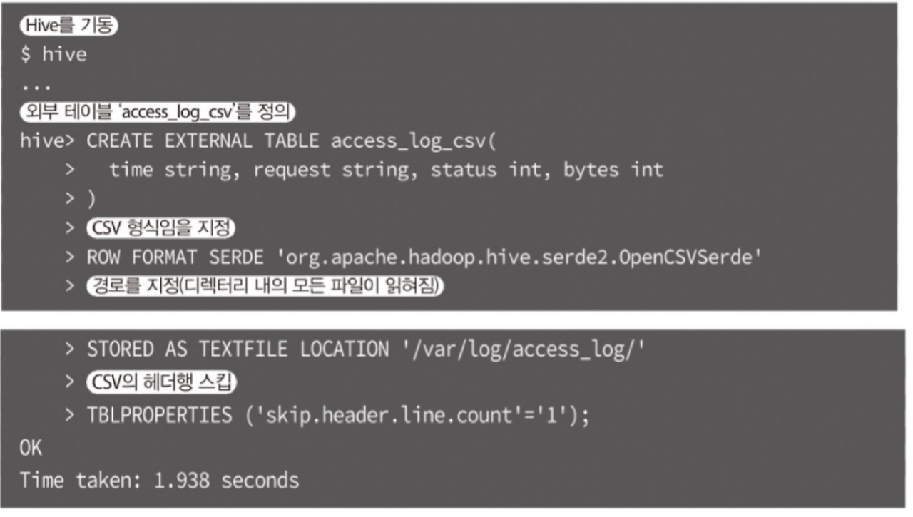

'외부 테이블' : Hive의 외부에 있는 특정 파일을 참고해 마치 거기에 테이블이 존재하는 것처럼 읽어 들이기 위해 지정한다.

Hive를 비롯한 대부분의 SQL-on-Hadoop의 쿼리 엔진은 MPP 데이터베이스처럼 데이터를 내부로 가져오지 않아도 텍스트 파일을 그대로 집계할 수 있다.

이처럼 데이터를 그 자리에서 바로 집계할 수 있는 성질은 특히 애드 혹 데이터를 분석하기에 유용하다.

시간을 들여 데이터를 전송하지 않고도 원하는 정보를 얻을 수 있다.


- 약 200만 레코드의 시간 8.6초

하지만 CSV 파일을 그대로 집계하는 것은 비효율적이다.

쿼리를 실행시킬 때마다 매번 텍스트를 읽어 들이기 때문에 확실히 빠르다고는 말할 수 없다.

속도를 높이기 위해서 열 지향 스토리지로 변환한다.

#### 열 지향 스토리지로의 변환 - 데이터 집계의 고속화(배치형 쿼리 엔진용)

여기서는 테이블을 열 지향 스토리지 형식인 ORC 형식으로 변환한다.

Hive의 경우, 테이블마다 스토리지 형식을 지정할 수 있다.

다음과 같이 새로운 테이블을 만들고 외부 테이블에서 읽은 데이터를 모두 저장한다.


ORC 형식으로서의 변환에는 다소 시간이 걸리지만, 변환 후의 테이블 집계는 1.5초까지 단축되었다.

파일 크기도 원래의 CSV 파일과 비교하면 10분의 1이하로 줄어들었다.

이처럼 텍스트 데이터를 열 지향 스토리지로 변환함으로써 데이터의 집계가 크게 고속화된다.

그러나 그것의 작성은 시간이 걸리는 프로세스이므로, Hive와 같은 배치형의 쿼리 엔진에서 실행하는 데 적합하다.

#### Hive로 비정규화 테이블을 작성하기

데이터의 구조화가 완료되면 다음은 데이터 마트의 구축을 해야 함

- 테이블을 결합 및 집약해서 ‘비정규화 테이블’을 만듦
- 이 때 Presto같은 대화형 쿼리 엔진을 사용할 것인지, Hive 같은 배치형 쿼리 엔진을 사용할 것인지에 따라 생각이 달라짐
  - Hive → 시간이 걸리는 배치 처리
    - 비정규화 테이블이 수억 레코드나 되면, 그것을 데이터 마트로 내보내는 것만으로도 상당한 시간이 소요됨
    - 쿼리 엔진 자체의 성능은 최종적인 실행 시간에 그다지 많은 영향을 끼치지 않음
    - 이렇게 비정규화 테이블을 만드는 데 오랜 시간이 걸리는 것은 흔한 일이며, 그렇기에 가능한 한 효율적인 쿼리를 작성해야 함.
- Hive의 쿼리를 개선하는 예
  - 서브 쿼리 안에서 레코드 수를 줄이는 방법
  - 데이터의 편향을 방지하는 방법

#### 서브 쿼리 안에서 레코드 수 줄이기 - 초기 단계에서 팩트 테이블 작게 하기

Hive는 데이터베이스가 아닌 데이터 처리를 위한 배치 처리 구조임. 따라서, **읽어 들이는 데이터의 양을 의식하면서 쿼리를 작성**하지 않으면 생각한 만큼의 성능이 나오지 않는다


- 팩트 테이블(access_log)과 디멘션 테이블(user)을 결합하고 WHERE로 조건을 부여
- 팩트 테이블을 필터링할 조건이 없기 때문에, 모든 데이트럴 읽어 들인 후에 결합하고 이후에 나오는 WHERE에 의해 검색을 하게 됨
- 대량의 중간 데이터가 생성되고, 그 대부분을 그냥 버려 낭비가 큰 처리가 됨

보다 효율적인 쿼리의 예

- 서브 쿼리 안에서 팩트 테이블을 작기 함.
- ‘초기에 팩트 테이블을 작게 하는 것’이 빅데이터의 집계에서 중요함

#### 데이터 편향 피하기 - 분산 시스템의 성능 발휘를 위해

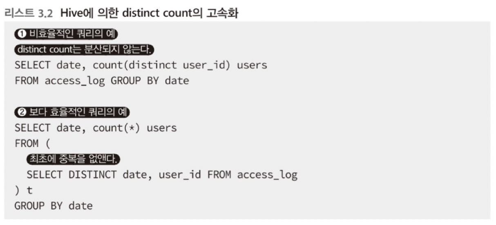

- 액세스 로그를 집계함으로써 일별 고유 유저 수의 추이를 알고 싶다고 하자
- (1)과 같은 쿼리가 있을 수 있다. 이 쿼리는 distinct count를 사용하고 있는데 실제로 느리지 않다.
- distinct count는 분산되지 않아도 GROUP BY에 의한 그룹하는 분산 처리된다.
- 만약 30일 동안의 데이터가 있다면 이 쿼리는 최대 30으로 분할되므로 충분히 고속으로 실행된다.
- 단, 그것은 하루 데이터양이 거의 **균등**하다는 조건이다.

만약 데이터에 편차가 있다면 문제가 표면화된다.

- 날짜가 아니라 웹페이지당 고유 방문자 수를 알고 싶다고 하자.
- 웹페이지의 조회 수에는 큰 편차가 있기 때문에 하나의 웹페이지만 다른 웹페이지보다 100배의 접속이 발생해도 이상하지 않다.
- 그러면 그 웹페이지에 대한 distinct count만이 극단적으로 늦어지고 전체적으로 쿼리 실행 시간이 늘어나게 된다.

이것이 데이터 편향 문제다.

- 분산 시스템의 성능을 발휘하기 위해서는 이러한 데이터의 편차를 최대한 없애고 모든 노드에 데이터가 균등하게 분산되도록 해야 한다.
- (2)처럼 SELECT DISTINCT로 중복을 제거함으로써 부하를 잘 분산하면서 데이터의 양을 줄일 수 있다.
- 마찬가지로 데이터의 편차가 발생하기 쉬운 구문으로는 테이블의 결합과 ORDER BY에 의한 정렬 등이 있다.
- 이 구문도 일부 노드에 데이터가 집중되는 것에 의해 편향이 발생한다.

실제 데이터 - 30GB, row 4억개

```sql
trino> SELECT log_date, count(distinct refine_query) AS queries
    -> FROM test_table
    -> WHERE log_date between '2024-11-01' AND '2024-11-04'
    -> GROUP BY 1;
  log_date  | queries
------------+----------
 2024-11-02 | 16000000
 2024-11-04 | 35000000
 2024-11-01 | 30000000
 2024-11-03 | 16000000
(4 rows)

Query 20241105_123553_00003_heha4, FINISHED, 4 nodes
Splits: 3,696 total, 3,696 done (100.00%)
11.66 [442M rows, 1.75GB] [37.9M rows/s, 153MB/s]


trino> SELECT log_date, count(*) as queries
    -> FROM (
    ->     SELECT DISTINCT log_date, refine_query
    ->     FROM test_table
    ->     WHERE log_date between '2024-11-01' AND '2024-11-04'
    -> ) t
    -> GROUP BY 1;
  log_date  | queries
------------+----------
 2024-11-02 | 16000000
 2024-11-04 | 35000000
 2024-11-01 | 30000000
 2024-11-03 | 16000000
(4 rows)

Query 20241105_123607_00004_heha4, FINISHED, 4 nodes
Splits: 3,619 total, 3,619 done (100.00%)
6.81 [442M rows, 1.71GB] [64.9M rows/s, 257MB/s]

```

### 대화형 쿼리 엔진 Presto의 구조 - Presto로 구조화 데이터 집계하기

Hive같은 배치형 쿼리 엔진은 작은 쿼리를 여러 번 실행하는 대화형 데이터 처리에는 적합하지 않음. 쿼리 실행의 지연을 감소시키는 것을 목적으로 개발된 것이 ‘대화형 쿼리 엔진’ 임

이 분야에서 자주 참고되는 기술은 2010년 구글에서 발표된 ‘Dremel’임. 수천 대의 컴퓨터에 분산된 열 지향 스토리지를 사용하여 집계 가속화

Presto: 2013년 말 페이스북에서 출시됨
Trino: 2020년 trademark 문제로 original creator가 페이스북나와서 리브랜딩

#### 플러그인 가능한 스토리지 - 하나의 쿼리 안에서 여러 데이터 소스에 연결 가능

Presto의 특징: 플러그인 가능한 스토리지 설계

- 전용 스토리지를 갖고 있디 않으므로 Hive와 마찬자기로 다양한 데이터 소스에서 직접 데이터를 읽어 들인다.

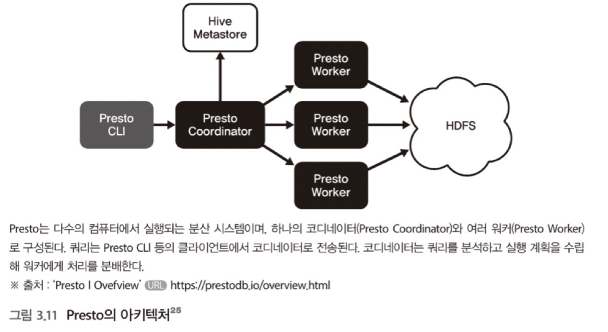

- Presto는 Hive 메타스토어에 등록된 테이블을 가져올 수 있으므로, Hive에서 만든 구조화 데이터를 좀 더 집계하는 목적에 적합함.
- Presto가 그 성능을 최대한 발휘하려면, 원래 스토리지가 열 지향 데이터 구조로 되어 있어야 함
- Presto는 특히 ORC 형식의 로드에 최적화되어 있으며, 그것을 확장성이 높은 분산 스토리지에 배치하여 최대의 성능을 발휘함.
- 데이터의 로딩 속도를 높이려면 Presto 클러스터를 분산 스토리지와 네트워크의 가까운 곳에 설치한 후에 그것들을 가능한 한 고속 네트워크에 연결하도록 해야 함

#### CPU 처리의 최적화 - 읽기와 코드 실행 병렬 처리

- Presto는 SQL의 실행에 특화된 시스템으로, 쿼리를 분석하여 최적의 실행 계획을 생성하고, 그것을 자바의 바이트 코드로 변환함. 이는 presto의 워커 노드에 배포되고, 그것은 런타임 시스템에 의해 기계 코드로 컴파일됨
- 코드는 병렬로 실행됨. 따라서 CPU 리소스만 충분하다면 데이터의 읽기 속도가 쿼리의 실행 시간을 결정하게 됨.

#### 인 메모리 처리에 의한 고속화 - 쿼리 실행에는 가급적 대화형 쿼리 엔진 사용

- Presto는 쿼리의 실행 과정에서 디스크에 쓰기를 하지 않음. 모든 데이터 처리를 메모리상에서 실시하고, 메모리가 부족하면 기다리거나 실패함.
- 취급하는 데이터의 양이 아무리 많아도, 비례하여 메모리 소비가 늘어나지 않음.
- 따라서, 메모리상에서 할 수 있는 것은 메모리상에서 실행하고, 아무래도 디스크가 있어야 하는 일부 데이터 처리만을 Hive등에 맡기는 것이 효과적.
- 몇 시간이나 걸리는 대규모 배치 처리와 거대한 테이블끼리의 결합 등에는 디스크를 활용해야 함. 단기간 쿼리 실행에는 대화형 쿼리 사용

#### 분산 결합(distributed join)과 브로드캐스트 결합 (broadcast join)

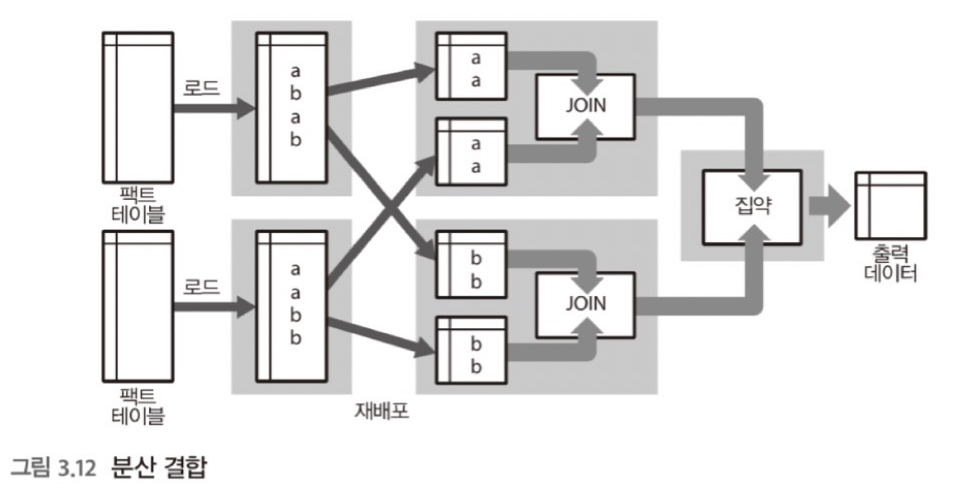

테이블의 결합은 종종 대량의 메모리를 소비한다.

특히 2개의 팩트 테이블을 결합하는 경우에는 매우 많은 조인 키를 메모리상에 계속 유지해야 한다.

Presto는 기본적으로 '분산 결합(distributed join)'을 실시하며, 같은 키를 갖는 데이터는 동일한 노드에 모인다.

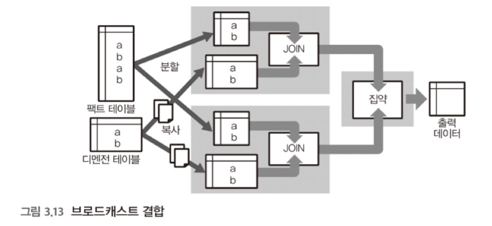

분산 결합에는 노드 간의 데이터 전송을 위한 네트워크 통신이 발생하기 때문에 종종 쿼리의 지연을 초래한다.

한쪽 테이블이 충분히 작은 경우에는 '브로드캐스트 결합'을 사용하여 처리 속도를 크게 고속화할 수도 있다.

이 경우, 결합하는 테이블의 모든 데이터가 각 노드에 복사된다.

스타 스키마처럼 하나의 팩트 테이블에 복수의 디멘전 테이블을 결합하는 경우에는 디멘전 테이블은 메모리에 충분히 들어갈 정도로 작은 것이 대부분이다. 따라서, 처음에 한 번만 복사하면 팩트 테이블을 재배치할 필요가 없어서 테이블의 결합은 훨씬 빨라진다.

Presto에서 브로드캐스트 결합을 유효로 하려면 분산 결합을 명시적으로 무효화해야 한다.

또한, 쿼리 안의 SELECT 문으로 먼저 팩트 테이블을 지정하여 그것에 디멘전 테이블을 결합해야 한다.

#### 열 지향 스토리지 집계 - Presto에 의한 고속 집계

위와 같은 구조에 의해 Presto에서는 열 지향 스토리지의 집계를 매우 빠르게 실행할 수 있다.

### 데이터 분석의 프레임워크 선택하기 - MPP 데이터베이스, Hive, Presto, Spark


## 출처

- https://product.kyobobook.co.kr/detail/S000001916916
- https://velog.io/@toezilla/DB-빅데이터를-지탱하는-기술-3.-빅데이터의-분산처리-1
- https://velog.io/@toezilla/빅데이터를-지탱하는-기술-3.-빅데이터의-분산처리-2
- https://jbin0512.tistory.com/279
- https://jbin0512.tistory.com/280
