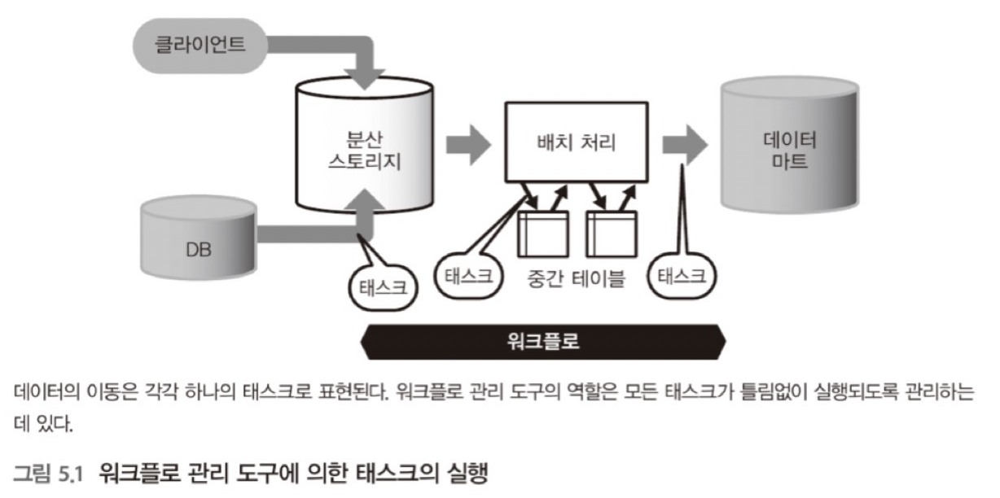
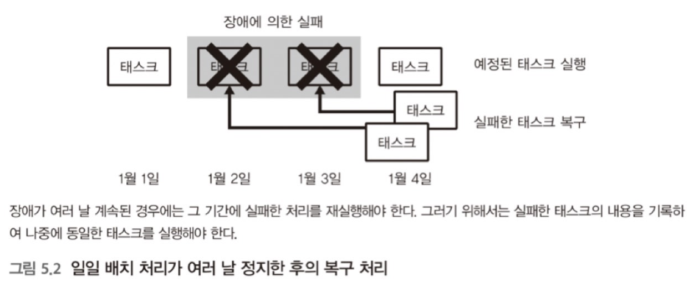
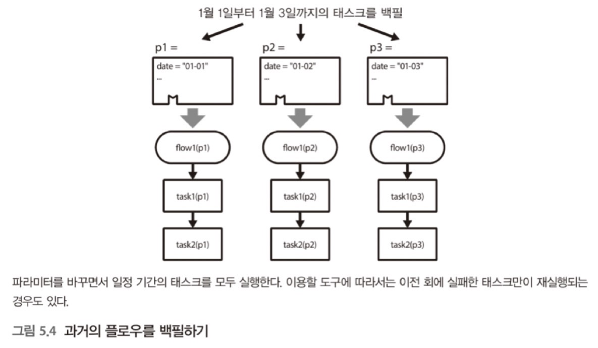
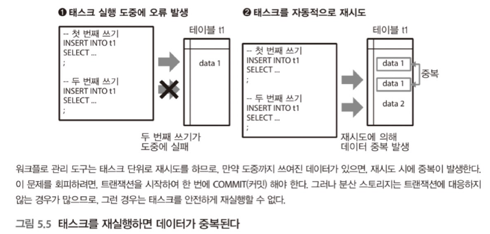
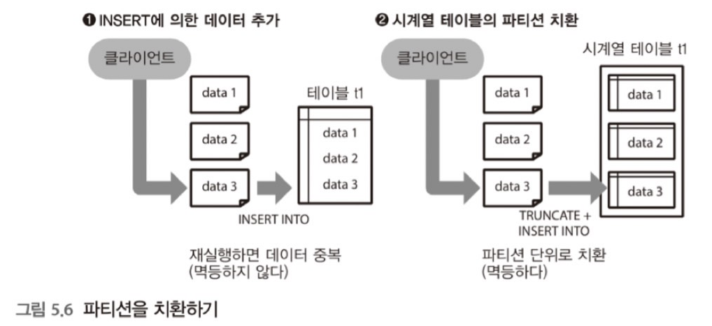
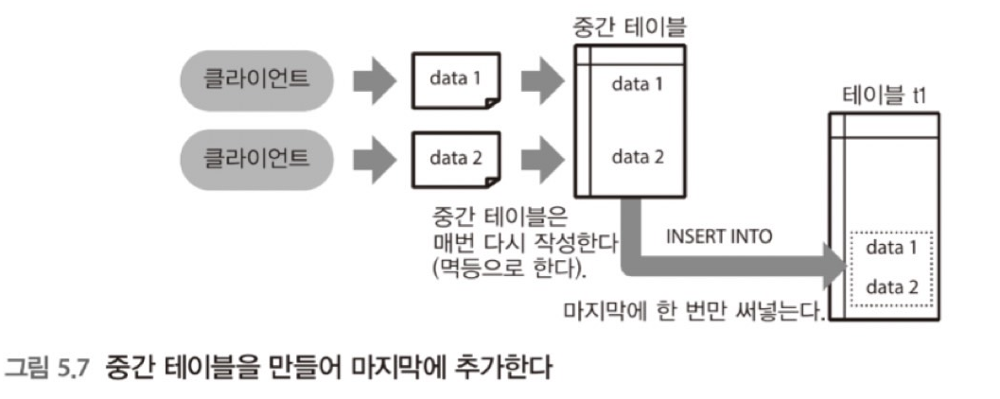
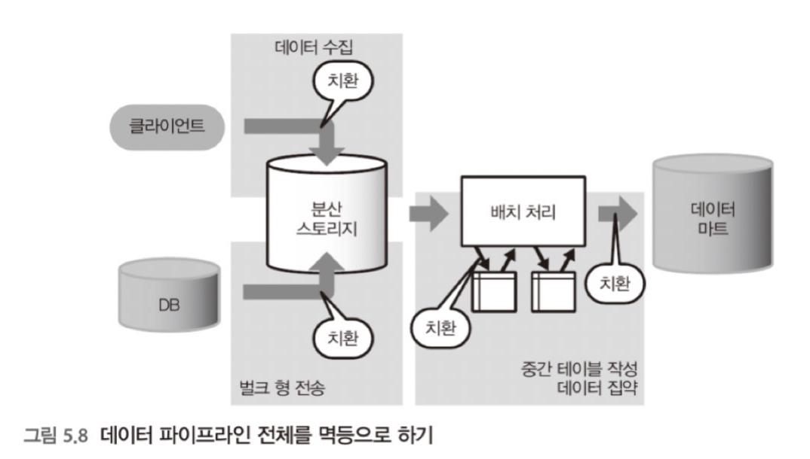
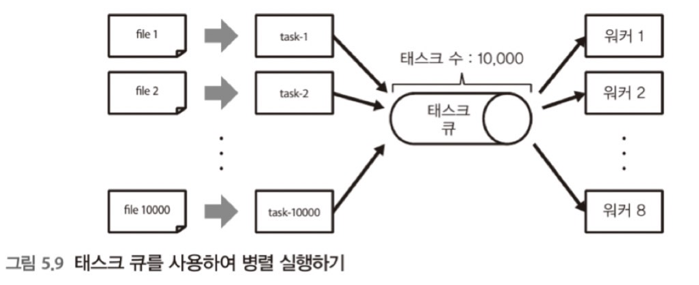
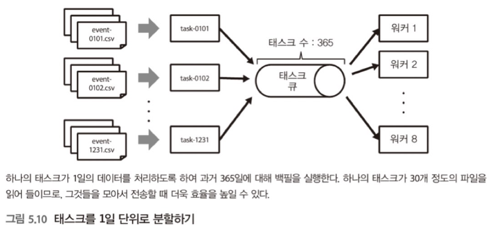

# 5. 빅데이터의 파이프라인

> 백필할때
> 왜 실행 속도를 낮춰서 부하를 떨어트리는게 해결이 될까? 왜 오류가 난 태스크를 재실행하면 성공할까?

## 5.1 워크플로 관리

> 정기적인 데이터 관리를 자동화하여 안정된 배치 처리를 실행하기 위해 워크플로 관리 도구를 도입

### [기초 지식] 워크플로 관리 - 데이터의 흐름을 일원 관리하기

일상적인 업무에는 수동으로 하는 것곽 자동화된 것이 있는데, 여기서는 자동화된 워크플로만을 가정한다.
태스크는 정해진 스캐줄에 따라 자동으로 실행되고, 무언가 비정상적 일이 발생한 경우에는 사람이 개입하여 문제를 해결한다.

#### 워크플로 관리 도구

주요 역할

- 정기적으로 태스크를 실행
- 비정상적인 상태를 감지하여 그것에 대한 해결을 돕는 것

오픈 소스의 워크플로 관리 도구의 예

| 이름                                         | 종류        | 개발사                         |
| -------------------------------------------- | ----------- | ------------------------------ |
| [Airflow](https://github.com/apache/airflow) | 스크립트 형 | Airbnb                         |
| Azkaban                                      | 선언형      | Linkedin                       |
| Digdag                                       | 선언형      | 트레주어 데이터                |
| Luigi                                        | 스크립트 형 | Spotify                        |
| Oozie                                        | 선언형      | The Apache Software Foundation |

#### 워크플로 관리 도구와 태스크

데이터 파이프라인의 실행 과정에서는 데이터를 잇달아 이동하면서 정해진 처리를 반복한다.
이때 실행되는 개별 처리를 '태스크(task)'라고 부른다.
태스크를 단지 실행하는 것만이라면 특별한 도구 필요 없이 자신이 직접 만든 스크립트를 실행시키는 것만으로도 데이터 파이프라인을 실현할 수 있다.



#### 기본 기능과 빅데이터에서 요구되는 기능

워크플로 관리를 위해 전용 도구를 사용하는 이유 : 태스크 실행에 실패할 수 있기 때문이다.

데이터 파이프라인이 복잡해지거나, 태스크의 수가 증가하면 실패한 태스크를 다시 실행하는 일 또한 점차 어려워진다.

워크플로 관리 도구는 주로 다음과 같은 기능을 제공한다.

- 태스크를 **정기적인 스케줄로 실행**하고 그 결과 통지하기
- 태스크 간의 **의존 관계**를 정하고, 정해진 **순서**대로 빠짐없이 실행하기
- 태스크의 실행 결과를 보관하고, 오류 발생 시에는 **재실행**할 수 있도록 하기

#### 선언 형과 스크립트 형 - 워크플로 관리 도구의 종류

'선언형(declarative) 도구'

- XML이나 YAML 등의 서식으로 워크플로를 기술하는 타입 (Oozie)
- 선언형 도구에서는 **미리 제공된 기능**만 이용할 수 있는데, 그 범위 안이라면 최소한의 기술로 태스크를 정의 가능
- 누가 작성해도 동일한 워크플로가 되기 때문에 유지 보수성이 높다
- 동일 쿼리를 파라미터만 바꾸어 여러 번 실행하거나, 워크플로를 단순 반복적으로 자동 생성하는 경우에도 선언형 도구가 사용

```xml
<workflow-app name ='wordcount-wf' xmlns="uri:oozie:workflow:0.1">
    <start to='wordcount'/>
    <action name='wordcount'>
        <map-reduce>
            <job-tracter>${jobTracker}</job-tracker>
            <name-node>${nameNode}</name-node>
            <configuration>
            ...
            </configuration>
        </map-reduce>
    </action>
</workflow-app>
```

'스크립트 형(Script) 도구'

- 스크립트 언어로 워크플로를 정의하는 유형 (Airflow)
- 스크립트 형의 특징은 그 유연성
- 일반적인 스크립트와 동일하게 변수나 제어 구문을 사용할 수 있으므로, 태스크의 정의를 프로그램이 한다
- 스크립트 언어에 의해 데이터 처리를 태스크 안에서 실행하는 것도 가능
- 예) 파일의 문자 코드를 변환하면서 서버에 업로드하는 식의 태스크는 스크립트 형 도구의 강점

```bash
# 쉘 스크립트의 ㅌ메플릿 정의
SCRIPT = '''
aws s3 cp --recursive s3://example/logs/{{ ds }}/ .
'''

# 쉘 스크립트를 실행하는 태스크 등록
task = BashOperator(task_id='data_transfer', bash_command=SCRIPT)
```

#### 오류로부터의 복구 방법 먼저 생각하기

데이터 파이프라인을 매일 동작시키다 보면, 뭔가 예기치 못한 오류가 분명 발생한다.
그것이 일시적인 장애든지 구현상의 버그든지 신속하게 문제를 해결하여 태스크를 재실행해야 한다.

예)

- 1일의 액세스 로그를 집계하는데 4시간의 배치 처리를 동작
- 만약 이 처리가 실패하여 다시 4시간에 걸쳐 재시도한다면, 그날의 워크플로에 큰 지연이 발생
- 후속의 태스크 중에는 예정된 시간까지 끝내지 않으면 새로운 문제를 일으키는 태스크가 있을지도 모름
- 그러면 하나의 실패가 연쇄적으로 확대돼서 결과적으로는 모든 태스크를 처음부터 다시 시작해야 하므로 하루를 낭비

빅데이터를 취급하고 있으면 다양한 오류가 발생한다.

- 네트워크의 일시적인 장애
- 하드웨어의 장애를 비롯하여 스토리지 용량 부족
- 쿼리 증가에 따른 성능 부족 등
- 일상적인 요인에서 발생하는 것부터 그다지 발생하지 않는 것까지 다양하다.

그 모든 것을 사전에 예상하는 것은 불가능하므로, 미리 예기치 못한 오류가 발생할 가능성을 고려하여 오류 발생 시의 대처 방법을 미리 결정해두는 것이 중요하다.

워크플로 관리에서는 태스크의 실행 순서를 정하는 것과 동시에 오류로부터 어떻게 회복할 것인가라는 계획을 정한다.

무엇인가 문제가 발생해도 신속하게 회복할 수 있도록 오류에 강한 워크플로를 구축하여 매일 반복되는 데이터 처리를 안정적으로 실행할 수 있도록 노력한다.

#### 복구와 플로우의 재실행

오류에는 수많은 가능성이 있으므로 기본적으로 워크플로 관리에서는 오류로부터 자동 회복할 수 있다는 점은 고려하지 않는다.

대신에 수작업에 의한 '복구(recovery)'를 전제한 태스크를 설계한다. 실패한 태스크는 모두 기록하여 그것을 나중에 재실행할 수 있도록 한다.



여기서는 워크플로 관리 도구에 의해 실행되는 일련의 태스크를 '플로우(flow)'라고 한다.

각 플로우에는 실행 시에 고정 파라미터가 부여되어 있다.

- 일별 배치 처리라면 특정 날짜가 파라미터

동일 플로우에 동일 파라미터를 건네면 완전히 동일한 태스크가 실행되도록한다. 이유는 플로우가 도중에 실패해도 나중에 동일 파라미터로 재실행이 가능하기 때문이다.

이것이 복구의 기초다.

대부분의 워크플로 관리 도구는 과거에 실행한 플로우와 그 파라미터를 자동으로 데이터베이스에 기록하게 되어 있다. 그래서 실패한 플로우를 선택하여 재실행하는 것만으로 복구가 완료된다. 웹 브라우저로 오류의 상세 내용을 확인하고 클릭 한 번으로 재실행할 수 있는 도구를 선택하면 좋을 것이다. 대부분 오류는 일시적인 것이 많아 시간을 두고 재실행하는 것만으로도 해결되는 경우가 많기 때문이다.

TIP: 태스크를 되도록 작게 유지하기

- 빅데이터의 워크플로는 시간이 오래 걸리는 것도 있기 때문에, 오류가 발생할 때마다 처음부터 재실행하는 것은 너무 많은 시간이 걸린다

#### 재시도 - 여러 차례 반복되는 오류는 자동화하고 싶다

여러 번 발생하는 오류에 대해서는 되도록 자동화하여 수작업 없이 복구하고 싶을 것이다. 간단한 것은 태스크 단위의 자동적인 '재시도(retry)', 즉 단순한 재실행이다. 곧바로 재시도해도 실패를 반복하는 일이 많기 때문에, 재시도 간격을 5분 or 10분 정도로 두면 성공할 수 있다.

재시도를 반복해도 문제가 없는 태스크라면, 1회나 2회의 재시도를 실행해도 좋을 것이다. 그러나 그 이상은 태스크의 재시도로 대처하는 것이 아니라 올바른 문제 해결 방법을 찾아야 한다.

#### 백필 - 일정 기간의 플로우를 연속해서 실행하는 구조

실패한 플로우를 복구하는 다른 하나의 수단은 플로우 전체를 처음부터 다시 실행하는 것이다. 이를 위해 이용할 수 있는 것이 '백필(backfill)'의 기능이다.

백필

- 파라미터에 포함된 일시를 순서대로 바꿔가면서 일정 기간의 플로우를 연속해서 실행하는 구조
- 태스크의 실패가 며칠 동안이나 계쏙된 후에 이를 모두 모아서 재실행하고 싶을 경우
- 새롭게 만든 워크플로를 과거로 거슬러 올라가 실행하고 싶은 경우



대규모의 백필을 실시할 때는 자동적인 재시도는 모두 무효로 하고, 오류는 모두 통지하는 편이 좋다. 테스트 삼아 조금씩 백필을 실행하여 어떠한 오류가 발생했는지, 오류가 발생하지 않는지를 확인한다.

오류가 자주 발생하면, 실행 속도를 낮춰서 부하를 떨어뜨려야 한다.

마지막에 오류가 난 태스크만을 재실행하면 모든 백필이 완료된다.

### 멱등한 조작으로 태스크를 기술하기 - 동일 태스크를 여러번 실행해도 동일한 결과가 된다

#### 원자성 조작

예를 들어 SQL을 실행하는 태스크가 있고, 그 안에 INSERT 문을 2회 호출하고 있다고 하자. 만약 첫 번째의 INSERT가 종료한 상황에서 오류가 발생하면, 태스크가 재실행된 때에 동일한 데이터가 다시 쓰이게 될 수 있다.



적어도 워크플로 관리 도구에 의해 자동적인 재시도는 피하고, 오류의 내용을 반드시 확인한 뒤에 수동으로 복구해야 한다.

#### 멱등한 조작 - 추가와 치한

더욱 확실한 것은 '동일한 태스크를 여러 번 실행해도 동일한 결과'가 되도록 하는 것이다. 이것을 '멱등한 조작(idempotent operation)'이라고 부른다. SQL이라면 '테이블을 삭제한 후에 다시 만들기'가 멱등한 조작의 예다.

```sql
DROP TABLE IF EXISTS "t1";
CREATE TABLE "t1";
INSERT INTO "t1" ...;
```

#### 멱등항 추가

과거의 데이터를 치환하면 멱등하게 되긴 하지만, 그러면 부하가 커진다. 그래서 준비한 것이 '테이블 파티셔닝' 사고방식이다. 예를 들면, 테이블을 1일마다 또는 1시간마다 파티션으로 분할하고, 파티션 단위로 치환하도록 한다.



태스크를 멱등으로 구성하는 것이 어렵다면, 그것을 포기하고 원자성을 지닌 추가만으로 운영한다. 그 경우, 태스크를 재실행하면 데이터가 중복될 가능성이 있으므로, 자동적인 재시도는 반드시 무효로 하고, 오류 발생 시에는 수작업으로 복구하는 편이 좋다.

#### 원자성을 지닌 추가

복잡한 플로우에서는 하나의 테이블에 몇 번이고 데이터를 써넣을 때가 있다. 그 경우에는 추가를 반복하는 것이 아니라 중간 테이블을 만들어 처리한 후, 마지막에 목적 테이블에 한 번에 추가하는 것이 안전하다.

이렇게 하면 만약 플로우의 실행 도중에 문제가 발생해도 어정쩡하게 데이터가 쓰이는 일이 없으며, 최악의 걍우 중간 테이블을 삭제하여 다시 한번 처음부터 재실행할 수 있다



```sql
DROP TABLE IF EXISTS "t1";
CREATE TABLE "t1";
INSERT INTO "t1" ...;
INSERT INTO "t1" ...;

INSERT INTO "target_table"
SELECT * FROM "t1";
```

### 워크플로 전체를 멱등으로 하기

데이터 마트를 구축하는 플로우에서도 되도록 추가는 삼가고 테이블마다 치환하도록 한다. 그 과정에서 만들어진 중간 테이블도 가능한 한 치환하는 것이 바람직하지만, 성능상의 이유 등으로 추가해야 할 경우도 있다.

각 태스크를 멱등으로 하는 것이 이상적이지만 필수는 아니다. 최종적으로 워크플로가 안정적으로 실행되고 있는 한, 태스크가 멱등이지 않아도 동작에 지장은 없다.



### 태스크 큐 - 자원의 소비량 컨트롤하기

워크플로 관리 도구에서 요구되는 다른 하나의 커다란 역할은 외부 시스템의 부하 컨트롤이다. 태스크의 크기나 동시 실행 수를 변화시킴으로써 자원의 소비량을 조정하여 모든 태스크가 원활하게 실행되도록 한다.

너무 대량의 태스크를 동시 실행하면 서버에 과부하가 걸리므로 어느 정도 제한을 해야 한다. 이때 사용할 수 있는 것이 '잡 큐(job queue)' 또는 '태스크 큐(task queue)'라고 불리는 구조다. 모든 태스크는 일단 큐에 저장되고 일정 수의 워커 프로세스가 그것을 순서대로 꺼내면서 병렬화가 실현된다.

밑의 사진의 경우 8개의 워커를 가동하면, 8개가 병렬로 태스크 실행될 수 있다.



#### 병목 현상의 해소

워커의 수를 늘리면 좀 더 실행 속도를 높일 수 있다. 8코어의 서버라면 20개 정도의 태스크를 동시에 실행해도 문제없을 것이다. 단, 워커를 너무 증가시키면 어디선가 병목 현상이 발생해서 성능의 향상이 한계점에 도달하거나 오류가 발생한다.

워크플로 실행 시에 자주 발생하는 문제(서버의 내부적인 요인)

| 증상                  | 대책                                                                 |
| --------------------- | -------------------------------------------------------------------- |
| CPU 사용률 100%       | CPU 코어 수를 늘린다. 서버를 증설한다.                               |
| 메모리 부족           | 메모리를 증설한다. 스왑 디스크를 추가한다. 태스크를 작게 분할한다.   |
| 디스크 넘침           | 각 태스크가 임시 파일을 삭제하고 있는지 확인한다. 디스크를 증설한다. |
| 디스크 I/O의 한계     | SSD 등의 고속 디스크를 사용한다. 여러 디스크로 분산한다.             |
| 네트워크 대역의 한계  | 고속 네트워크를 사용한다. 데이터의 압축률을 높인다.                  |
| 통신 오류나 타임 아웃 | 시스템 상의 한계일 가능성이 있다. 서버를 분리한다.                   |

#### 태스크 수위 적정화 - 너무 크거나 너무 작지 않은 정도로 잘 분할하기

처음부터 '하나의 파일 전송을 하나의 태스크'로 고려한 것이 문제였다. 작은 태스크를 다수 실행하면 오버헤드만 커져서 실행 시간이 증가하고 오류 발생률을 높이는 요인이 된다. 하나의 파일을 5초에 처리할 수 있다면, 수백 개의 파일 정도를 모아서 하나의 태스크로 하는 것이 적정한 크기다.

태스크에는 날짜와 시간이 파라미터로 건네진다는 점을 기억하자. 각 태스크는 지정된 시간의 데이터를 모아 처리하도록 구현한다. 예를 들어, 파일이 1년 걸려서 만들어 진 것이라면 태스크를 1일마다 나눔으로써 생성되는 태스크의 수는 365개까지 줄일 수 있다.



태스크가 너무 클 경우에는 나누고, 너무 작을 경우에는 하나로 모음으로써 각 태스크가 적절한 크기가 될 수 있도록 조정한다. 그 다음에 여러 태스크를 동시에 실행하도록 워크의 수를 늘려 두면, 한정된 계산 자원을 낭비하지 않고 활용할 수 있다.

## 출처

- https://product.kyobobook.co.kr/detail/S000001916916
- https://jbin0512.tistory.com/288
